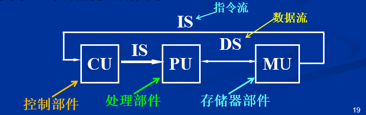
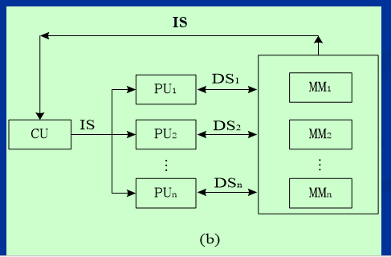
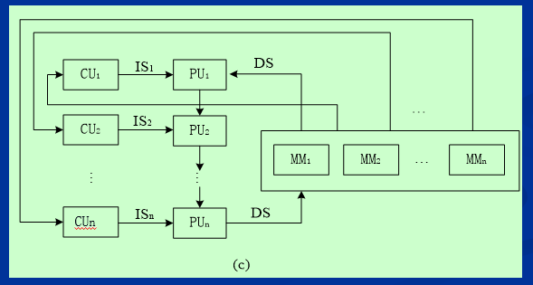
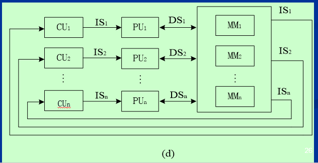
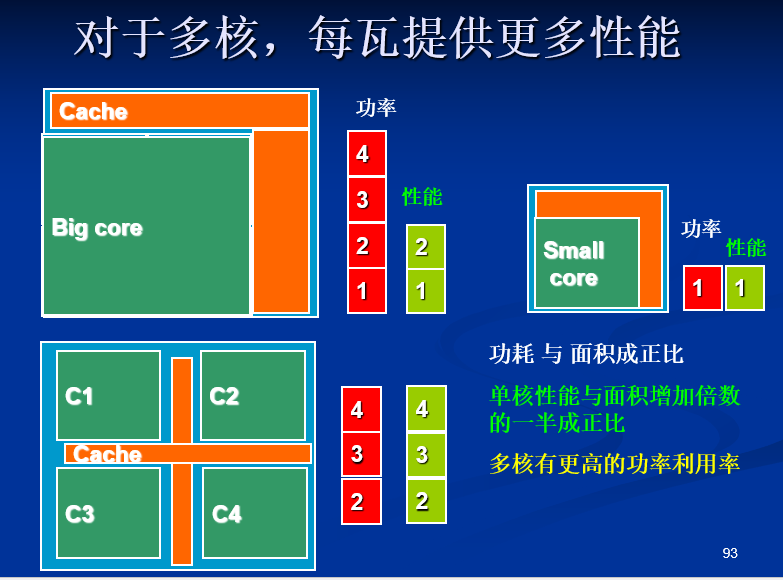

## 1.1 引言

### Ⅰ. 核心观点：微处理器的崛起

PPT开篇用一张“计算机食物链”的图生动地揭示了过去几十年计算机领域的核心变革：

- **旧时代**: 市场由大型机（Mainframe）、小型机（Minicomputer）、向量超级计算机（Vector Supercomputer）等“大鱼”主导。
- **新时代**: 大量廉价、高效的**微处理器（Microprocessor）**如“小鱼”群，通过集群（NOW - Network of Workstations）的方式，不仅占领了个人计算市场（PC, Workstation），还逐步蚕食甚至取代了传统“大鱼”的生态位。

**结论**: 整个计算机工业已经构建于**微处理器**之上。

### Ⅱ. 性能飞跃的两个引擎

计算机性能在过去60多年取得了惊人的进步，其背后主要有两个驱动力：

1.  **实现技术的发展 (摩尔定律)**
    - **集成电路 (IC)**: 晶体管密度和时钟频率的不断提升。
    - **存储部件**: RAM和磁盘（DISK）的容量、速度飞速发展，成本急剧下降。
    - **外部设备**: I/O设备性能的改进。

2.  **计算机体系结构的革新 (Architectural Innovation)**
    - **指令集演进**: 从简单的设计，到复杂的CISC（如VAX），再回归到精简高效的**RISC**。RISC的出现是性能提升的关键转折点。（*注：Intel的x86指令集虽然对外是CISC，但其内部也采用了RISC微指令（Micro-op）来提升效率。*）
    - **高速缓存 (Cache)**: 将Cache集成在芯片上，极大地缓解了处理器与内存之间的速度鸿沟。

**一个惊人的对比**: 2012年售价 **500美元** 的计算机，其性能远超1985年售价 **1,000,000美元** 的计算机。

### Ⅲ. 微处理器性能发展的三个历史阶段

从性能增长率来看，微处理器的发展可以清晰地划分为三个时代：

#### 阶段一：技术驱动时代 (1978-1986)

-   **年均性能增长**: **~25%**
-   **核心驱动力**: 主要依赖**实现技术**的进步（即摩尔定律带来的晶体管红利）。
-   **代表技术**:
    -   可编程控制器 (Programmable Controller)
    -   单片微处理器 (Single-Chip Microprocessors)
    -   个人计算机 (PC)

#### 阶段二：体系结构与技术双轮驱动的黄金时代 (1986-2003)

-   **年均性能增长**: **~52%** (空前的高速增长)
-   **核心驱动力**: **体系结构革新 (RISC)** 与 **实现技术** 进步并驾齐驱。
-   **核心思想**: 开发**指令级并行 (Instruction-Level Parallelism - ILP)**，在单核内同时执行多条指令。
-   **代表技术**:
    -   **80年代**: 指令流水线 (Pipelining)、高速缓存 (Cache)。
    -   **90年代**:
        -   **超标量 (Superscalar)**: 每个时钟周期发射多条指令。
        -   **乱序执行 (Out-of-Order Execution, OOO)** / 推测执行 (Speculative Execution): 打破指令的严格顺序，最大化利用计算单元。

#### 阶段三：并行计算时代 (2004-至今)

-   **年均性能增长**: **~22%** (增速放缓)
-   **核心挑战**: **指令级并行 (ILP) 的开发遇到瓶颈**。单纯提升时钟频率和单核复杂度的功耗和设计难度过高（即所谓的“功耗墙”和“设计墙”）。
-   **发展趋势 (范式转移)**:
    1.  **从追求更快的单核 => 单芯片多处理器 (Multi-Core)**
    2.  **从 ILP => TLP (线程级并行) 和 DLP (数据级并行)**
    3.  **从隐式并行 => 显式并行** (需要程序员/编译器明确地编写并行代码)

#### Ⅳ. 性能增长带来的变革与效果

-   **适应性增强**: 计算机的能力大大增强，能够满足各种用户的需求。
-   **市场重塑**: 所有类型的计算机都开始**基于微处理器**进行设计。
    -   **Minicomputer** => 演变为由**多微处理器**构成的**服务器**。
    -   **Mainframe** => 演变为由**大量微处理器**组成的**服务器集群**。
    -   **Supercomputer** => 演变为由**大规模服务器**构成的**并行计算系统**。

---

**总结**: 这几张PPT清晰地勾勒出了计算机体系结构的发展脉络：从微处理器的诞生，到利用**指令级并行(ILP)**技术实现的单核性能黄金十年，再到因ILP瓶颈而转向**多核与并行计算(TLP/DLP)**的新纪元。理解这段历史是掌握高级计算机体系结构的关键。

## 1.2 计算机的分类

### 1.2.1 计算机分类：Flynn 分类法

Flynn 分类法是一种经典的计算机体系结构分类方法，它根据**指令流**和**数据流**的数量将计算机系统分为四类。

-   **SISD (Single Instruction, Single Data) - 单指令流单数据流**
    -   **描述**: 传统的单处理器（Uniprocessor）计算机，一次执行一条指令来处理一个数据。
    -   **示例**: 早期的个人电脑、冯·诺依曼体系结构。

-   **MISD (Multiple Instruction, Single Data) - 多指令流单数据流**
    -   **描述**: 多条指令作用于同一个数据流。这种结构在理论上存在，但在商业产品中非常罕见。

-   **SIMD (Single Instruction, Multiple Data) - 单指令流多数据流**
    -   **描述**: 一条指令可以同时对多个数据执行相同的操作，非常适合数据并行任务。
    -   **特点**:
        -   编程模型相对简单
        -   硬件开销较低
    -   **示例**: 向量处理器、GPU、现代 CPU 中的多媒体扩展指令集（如 MMX, AVX）。

-   **MIMD (Multiple Instruction, Multiple Data) - 多指令流多数据流**
    -   **描述**: 系统中包含多个独立的处理器，每个处理器都可以执行不同的指令来处理不同的数据。
    -   **特点**:
        -   灵活性极高
        -   通常使用现成的微处理器（off-the-shelf micros）构建
    -   **示例**: 现代的多核处理器、分布式系统、超级计算机集群。

#### SISD: 单指令流单数据流 (Single Instruction, Single Data)

SISD 是最传统、最基础的计算机体系结构，通常被称为**串行计算机**。它是冯·诺依曼体系结构的典型代表。

##### 一、 基本定义与特征

1.  **单指令流 (Single Instruction)**
    -   在任何一个时钟周期内，CPU 的控制部件 (CU) 只发出一条指令。指令按顺序逐条执行。

2.  **单数据流 (Single Data)**
    -   在任何一个时钟周期内，处理部件 (PU) 只处理一个数据。

3.  **确定性执行 (Deterministic Execution)**
    -   这是 SISD 的一个核心特征。只要输入数据相同，程序每次运行的执行流程和最终结果都是完全一致的，不存在不确定性。

4.  **历史与实例**
    -   它是**最古老**的计算机类型。
    -   **例子**: 早期的多数微处理器，以及所有单核 CPU 的基本编程模型都属于 SISD。

##### 二、 经典结构模型

SISD 的结构可以用一个经典的处理流程图来表示：

-   **控制部件 (CU - Control Unit)**: 负责解码指令，生成控制信号，并发出**指令流 (IS - Instruction Stream)**。
-   **处理部件 (PU - Processing Unit)**: 接收并执行来自 CU 的指令，对从存储器获取的**数据流 (DS - Data Stream)** 进行运算。
-   **存储器部件 (MU - Memory Unit)**: 存储指令和数据，为 PU 提供数据。

这个模型清晰地展示了“单指令流”和“单数据流”的串行工作模式。

##### 三、 SISD 模型的改良与性能提升

虽然 SISD 的概念是串行执行，但为了突破性能瓶颈，现代处理器在保持 SISD 编程模型不变的情况下，内部引入了大量的并行技术，即**指令级并行 (Instruction-Level Parallelism - ILP)**。

这意味着，**对程序员来说，程序仍然是顺序执行的，但硬件底层却在并行处理。**

主要改良技术包括：

-   **流水线 (Pipelining)**
    -   将一条指令的执行过程（如取指、译码、执行、访存、写回）分解成多个阶段，让不同指令的不同阶段重叠执行，从而提高吞吐率。

-   **超标量 (Superscalar)**
    -   在一个时钟周期内发射并执行多条指令，需要处理器内部有多套执行单元。

-   **推测执行 (Speculative Execution) / 乱序执行 (Out-of-Order Execution)**
    -   不严格按照代码顺序执行指令。当某条指令因数据依赖而阻塞时，处理器会继续执行后面不相关的指令，以“填满”计算资源，最大化并行度。

**总结**: 现代的高性能单核 CPU，虽然在程序员的视角下是 SISD 模型，但其内部通过流水线、超标量和乱序执行等 ILP 技术，实现了高度的并行处理，早已不是最初的纯粹串行计算机。

#### SIMD: 单指令流多数据流 (Single Instruction, Multiple Data)

SIMD 是一种重要的并行计算机模型，其核心思想是**处理数据级并行 (Data-Level Parallelism - DLP)**。

##### 一、 基本定义与特征

1.  **单指令流 (Single Instruction)**
    -   在任何一个时钟周期，控制单元 (CU) 只发出一套指令。
    -   这套指令会被广播到**所有**的处理单元 (PU)。

2.  **多数据流 (Multiple Data)**
    -   每个处理单元都拥有自己独立的数据（来自不同的数据流或内存地址）。
    -   所有处理单元**同时**对各自的数据执行**相同**的操作。

##### 二、 结构与工作原理

##### 结构模型

SIMD 架构由一个中央**控制单元 (CU)** 和多个**处理单元 (PU)** 阵列组成：

-   **CU** 负责指令的获取和译码，并将解码后的单条**指令流 (IS)** 广播给所有的 PU。
-   **PU1, PU2, ..., PUn** 同时接收这条指令。
-   每个 PU 从各自的**存储器模块 (MM)** 中获取不同的**数据流 (DS)**，并执行相同的操作。

##### 工作示例

以下是一个典型的向量运算 `C[i] = A[i] * B[i]` 在 SIMD 架构下的执行过程：

| P1 (处理单元1)   | P2 (处理单元2)   | ...  | Pn (处理单元n)   |
| :--------------- | :--------------- | :--- | :--------------- |
| `load A(1)`      | `load A(2)`      | ...  | `load A(n)`      |
| `load B(1)`      | `load B(2)`      | ...  | `load B(n)`      |
| `C(1)=A(1)*B(1)` | `C(2)=A(2)*B(2)` | ...  | `C(n)=A(n)*B(n)` |
| `store C(1)`     | `store C(2)`     | ...  | `store C(n)`     |

所有处理单元 (P1 到 Pn) 都在同一时间执行相同的指令（如 `load A`, `multiply`, `store C`），但操作的数据分别是数组的第 1, 2, ..., n 个元素。

##### 三、 适用场景与执行特性

-   **适用场景**: 非常适用于处理**高度规整、可预测的操作**，尤其是在大型数据集上执行相同运算的场景。
    -   **典型例子**: 图像处理（对每个像素应用滤镜）、视频编码、科学计算、密码学等。

-   **执行特性**:
    -   **同步执行 (Synchronous)**: 所有处理单元像一个军队一样，步调一致地执行指令。
    -   **确定性执行 (Deterministic)**: 与 SISD 类似，只要输入相同，结果就完全一致。

##### 四、 实现类型与实例

SIMD 模型有多种实现形式，贯穿了计算机发展的历史：

1.  **处理器阵列 (Processor Arrays)**
    -   由大量简单的处理单元组成的阵列。
    -   *例子*: Connection Machine CM-2, Maspar MP-1。

2.  **向量流水线 (Vector Pipelines)**
    -   专为向量运算设计的硬件流水线，是早期超级计算机的核心。
    -   *例子*: IBM 9000, Cray C90, Fujitsu VP。

3.  **多媒体扩展指令集 (Multimedia Extensions)**
    -   在通用 CPU 中加入的 SIMD 指令集，这是现代最常见的 SIMD 形式。
    -   *例子*: 始于 1996 年 Intel Pentium 的 **MMX**，后发展为 **SSE**, **AVX** 等。

4.  **图形处理器 (GPU)**
    -   现代 GPU 是 SIMD 思想的集大成者，拥有成百上千个核心，能够高效执行大规模的数据并行任务。其架构常被称为 **SIMT (Single Instruction, Multiple Threads)**，是 SIMD 的一种演进模型。

#### MISD: 多指令流单数据流 (Multiple Instruction, Single Data)

MISD 描述了一个理论上的并行计算模型，其中多个独立的处理单元对同一个数据流执行不同的操作。

##### 一、 基本定义与结构

-   **多指令流 (Multiple Instruction)**: 每个处理单元 (PU) 拥有自己独立的控制单元 (CU) 和指令流 (IS)。这意味着每个 PU 都在执行一个不同的程序或算法。
-   **单数据流 (Single Data)**: 所有的处理单元操作的是同一个输入数据流 (DS)。

##### 二、 实践与应用

-   **罕见性**: 在现实世界中，纯粹的 MISD 架构**非常罕见**，几乎没有商业化的实例。一个被提及的实验室原型是卡内基梅隆大学的 **C.mmp 计算机 (1971)**。
-   **潜在应用场景**:
    -   **多频滤波器**: 多个不同的滤波器（代表不同的指令流）同时处理同一个信号（代表单数据流）。
    -   **多重加密**: 用多种不同的加密算法（不同指令流）同时对同一份信息（单数据流）进行加密，以增强安全性。
    -   **容错计算**: 多个处理单元执行不同的算法来处理同一份输入，并对结果进行比较验证，以发现错误（例如在航天器上）。

#### MIMD: 多指令流多数据流 (Multiple Instruction, Multiple Data)

MIMD 是目前最通用、最强大的并行计算模型，它代表了真正的并行计算机，核心是实现**线程级或任务级并行**。

##### 一、 基本定义与结构

-   **多指令流 (Multiple Instruction)**: 每个处理器都有自己的控制单元和指令流，可以独立地、同时地执行完全不同的程序或任务。
    -   *示例*: 一个处理器在执行科学计算循环，而另一个处理器可能在处理用户输入或执行一个完全不同的函数。
-   **多数据流 (Multiple Data)**: 每个处理器操作各自独立的数据集。

其结构可以看作是多个独立的 SISD 处理器通过某种方式（如共享内存或网络）连接在一起。

##### 二、 核心特点

1.  **灵活性与通用性**:
    -   比 SIMD **更灵活**，适应性更强，是实现**任务级并行 (Task-Level Parallelism)** 和**线程级并行 (Thread-Level Parallelism)** 的理想架构。

2.  **执行模式**:
    -   各处理器的执行可以是**同步的**，也可以是**异步的**。
    -   由于异步和资源共享，MIMD 系统的行为可能是**非确定性**的（例如，由于线程间的竞争条件），因此通常需要显式的同步机制（如锁、信号量）来保证程序的正确性。

3.  **数据并行能力**:
    -   虽然 MIMD 也能处理数据级并行（例如，将一个大数组分给多个核心处理），但其通信和同步的**开销通常比专门的 SIMD 架构更高**。

##### 三、 现代实例

MIMD 是当今最主流的并行架构，几乎无处不在：
-   **多核芯片**: 你电脑和手机里的多核 CPU 就是最典型的 MIMD 架构。
-   **多处理器服务器**: 由多个独立的 CPU 插槽（每个 CPU 又有多核）构成的服务器。
-   **分布式计算集群**: 由网络连接的多台计算机组成的集群系统。

#### Flynn 分类模型的局限性与混合架构

-   **Flynn 分类法是一个高度抽象和粗略的模型**
    -   它为理解并行计算提供了一个基础框架，但在描述现代复杂的处理器时显得过于简单。

-   **现代处理器是混合类型 (Hybrid Architecture)**
    -   许多现代并行处理器并非纯粹的 SISD、SIMD 或 MIMD，而是这几种模式的**混合体**。

-   **以 Cell 处理器为例**
    -   一个经典的例子是 IBM-Sony 设计的 **Cell 处理器**（曾用于 PlayStation 3），其内部结构是异构的：
        -   **一个 SISD 核心**: 包含一个通用的 Power 处理器 (PPE)，负责运行操作系统和进行复杂的逻辑控制。
        -   **八个 SIMD 核心**: 包含八个专用的处理单元 (SPE)，用于高效地执行大规模的数据并行计算任务（如物理模拟、图形渲染）。

-   **整体归类为 MIMD**
    -   尽管 Cell 处理器内部包含了 SISD 和 SIMD 组件，但从**整体系统**的角度来看，由于那个 SISD 核心和八个 SIMD 核心可以**独立地、并行地执行不同的指令流来处理不同的数据流**，因此 Cell 处理器整体上被归类为一个 **MIMD 处理器**。

### 1.2.2 市场分类

#### 市场分类：五类计算机

计算机体系结构的设计紧密围绕其目标市场的需求。根据市场应用，计算机可以分为五大类，每一类都有其独特的设计挑战和优化目标。

#### 核心对比总览

| 特征             | 个人移动设备 (PMD)               | 桌面计算机                 | 服务器                           | 集群/仓库级计算机 (WSC)          | 嵌入式计算机                       |
| :--------------- | :------------------------------- | :------------------------- | :------------------------------- | :------------------------------- | :--------------------------------- |
| **系统价格**     | \$100 - \$1,000                  | \$300 - \$25,000           | \$5,000 - \$10,000,000           | \$100,000 - \$200,000,000        | \$10 - \$100,000                   |
| **微处理器价格** | \$10 - \$100                     | \$50 - \$500               | \$200 - \$2,000                  | \$50 - \$250                     | \$0.01 - \$100                     |
| **关键设计问题** | 成本, 功耗, 多媒体性能, 响应速率 | **性价比**, 图形性能, 能耗 | **可靠性**, 吞吐量, **可扩展性** | **性价比**, 吞吐量, 能耗, 均衡性 | **价格**, 功耗, **专门应用的性能** |

#### 1. 个人移动设备 (Personal Mobile Devices - PMD)

-   **定义**: 拥有多媒体用户界面的无线设备，如手机、平板电脑。
-   **核心设计驱动**:
    -   **成本与能耗**: 电池续航是关键，对成本极其敏感。
    -   **尺寸与集成度**: 追求轻薄，通常使用闪存 (Flash Memory)。
    -   **实时性能**: 需要流畅的用户体验和快速的响应。
-   **优化方向**: 减少存储器容量、优化存储器访问、进行代码优化以适应有限资源。

#### 2. 桌面计算机 (Desktop Computers)

-   **市场地位**: 曾是最大、最先出现的计算机市场，包含了个人计算机和工作站。
-   **核心设计驱动**:
    -   **性价比 (Price-Performance)**: 市场竞争的核心，追求在给定价格下最大化计算和图形性能。
    -   **技术前沿**: 通常是最新、最高性能、低成本微处理器的首发应用领域。
-   **性能评估**: 主要通过**基准测试程序 (Benchmark)** 来衡量和比较性能。

#### 3. 服务器 (Servers)

-   **作用**: 在很多场景下取代了传统大型机，用于提供大规模、高可靠的文件和计算服务。
-   **三大核心特征**:
    1.  **可靠性 (Dependability)**: 必须保证 7x24 小时稳定运行，尤其在银行、证券等关键领域。采用 **ECC内存**、**RAID**、冗余电源、冗余风扇等技术。
    2.  **可扩展性 (Scalability)**: 需要方便地扩展计算能力、存储系统和I/O带宽，如支持更多的CPU、内存、PCI插槽、SCSI/RAID卡等。
    3.  **高吞吐量 (Efficient Throughput)**: 设计目标是最大化单位时间内处理的事务数或页面请求数，而非单个任务的响应速度。因此，服务器普遍采用**多处理器/多核架构**。
-   **分类**:
    -   按规模: 大型、中型、小型、入门级。
    -   按外形: 塔式服务器、机柜式服务器。
    -   按架构: 开放系统 (Intel+Windows/Linux) 和非开放系统 (RISC+Unix, 如IBM/HP/SUN)。

#### 4. 集群/仓库级计算机 (Clusters / Warehouse-Scale Computers - WSC)

-   **集群计算机 (Cluster)**:
    -   **定义**: 一组桌面计算机或服务器通过局域网连接，对外表现为一台大型计算机。
    -   **应用**: 在线销售、社交网络、视频分享、科学计算等。
    -   **关键问题**: 性价比、吞吐量、可靠性。

-   **仓库级计算机 (WSC)**:
    -   **定义**: 最大规模的集群，由成千上万台服务器构成。
    -   **应用**: 亚马逊、Google、淘宝等超大型网站，提供云计算服务。
    -   **特殊挑战**: **配电 (Power Distribution)** 和 **制冷 (Cooling)** 成为巨大的工程问题，其成本和能耗极为惊人。

#### 5. 嵌入式计算机 (Embedded Computers)

-   **定义**: 作为应用产品的核心控制部件，“隐藏”在各种装置、设备和系统中，如路由器、汽车、微波炉。
-   **核心特征**:
    -   **严格的资源限制**: 存储空间有限，功耗要求极低。
    -   **实时性要求**: 必须在规定的时间内完成任务（分为硬实时和软实时）。
    -   **高度定制化**: 处理器核心常与特定应用电路（如DSP）集成在一起。
    -   **价格与功耗分布极广**: 从10美分的8位微控制器到上百美元的64位高性能处理器。

-   **与非嵌入式系统的核心区别**:
    -   **能否运行第三方软件**。例如，手机（非嵌入式）可以随时下载App运行；而路由器（嵌入式）只能运行固化在硬件里的软件。

## **1.3 计算机系统结构定义与计算机的设计任务**

### 一、 核心三层定义：体系结构、组成与实现

#### 1. 计算机系统结构 (Computer Architecture) - “是什么”
-   **原始定义 (Amdahl, 1964)**: 从**程序员（特别是机器语言程序员）**角度看到的计算机系统属性，即概念性结构和功能行为。
-   **核心**: 软硬件之间的**接口 (Interface)**，定义了软件如何与硬件交互。
-   **关注点**:
    -   指令集系统 (ISA)
    -   数据类型与格式
    -   寄存器定义
    -   主存容量与编址方式
    -   I/O 机制

#### 2. 计算机组成 (Computer Organization) - “如何做”
-   **核心**: 计算机体系结构的**逻辑实现**。着眼于机器级内部各事件的排序、控制方式、各部件的功能及联系。
-   **关注点**:
    -   五大功能部件的组成
    -   数据通路 (Datapath) 和控制逻辑 (Control Logic) 的设计
    -   为达性能目标所采用的逻辑措施 (如流水线、多体交叉存储)

#### 3. 计算机实现 (Computer Implementation) - “用什么做”
-   **核心**: 计算机组成的**物理实现**，涉及具体的器件和微组装技术。
-   **关注点**:
    -   处理机、主存等部件的物理结构
    -   器件选定 (如 SRAM/DRAM 芯片)、集成度、速度与功耗
    -   信号传输、电源、冷却、整机装配技术

#### 4. 三者关系辨析与相互影响
-   **辨析示例 (以主存为例)**:
    -   **结构**: 主存容量多大？按字节编址？
    -   **组成**: 是否采用多体交叉存储来提速？
    -   **实现**: 主存用 SRAM 还是 DRAM 芯片？
-   **相同结构，不同组成**: **AMD Opteron 64** 与 **Intel Pentium 4** 结构相同 (x86 ISA)，但内部组成 (流水线、Cache) 不同，性能也不同。
-   **相同组成，不同实现**: **桌面版 Pentium 4** 与 **移动版 Pentium 4** 组成基本相同，但为适应不同市场，其物理实现 (时钟频率、功耗) 不同。

### 二、 体系结构的应用：系列机与软件兼容性

#### 1. 系列机 (Family Machine)
-   **定义**: 由同一制造商生产，具**相同系统结构**，但**不同组成和实现**的一系列计算机。
-   **核心思想**: 提供一个统一的编程模型 (ISA)，但在不同价位提供不同的性能。
-   **实例**: IBM 370 系列，低档机串行执行，高档机采用流水线等并行技术。

#### 2. 软件兼容性
-   **定义**: 同一软件可**不加修改**地运行于结构相同的各档机器上，结果一致，仅运行时间不同。
-   **分类**:
    -   **向后兼容 (Backward Compatibility)**: 早期软件能运行于更新的机器上。
    -   **向上兼容 (Upward Compatibility)**: 低档机软件能运行于高档机上。

#### 3. 系列机的演进与权衡
-   **演进方式**: 在原有结构基础上扩充，但必须**保持向后兼容**。例如 Intel 80x86 系列不断增加 MMX, SSE 等指令集，但始终兼容早期二进制代码。
-   **主要缺点**: 为保证兼容性，体系结构基本不变，这会**妨碍计算机体系结构的根本性发展**，成为“历史包袱”。

### 三、 核心接口：指令集体系结构 (ISA) 深度解析

#### 1. ISA 的核心作用与设计原则
-   **作用**: 作为软硬件之间的**接口**和**契约**。是开发者与硬件的接口，也是这一代芯片与下一代芯片的合同。
-   **优秀接口的设计原则**:
    -   允许**多种实现** (Portability, Compatibility)
    -   用在很多**不同方面** (Generality)
    -   为更高层提供**方便**的功能
    -   允许更底层能**有效**实现

#### 2. ISA 的 7 个重要特征
1.  **ISA 的类型**: 通用寄存器结构 vs. 早期累加器结构。
2.  **存储器访问**: 如按字节访问。
3.  **寻址方式**: 计算操作数的有效地址。
4.  **操作数类型和大小**: 如 8位字符，32位整型数。
5.  **操作类型**: 数据传输，算术/逻辑运算。
6.  **控制流指令**: 转移，子程序调用/返回。
7.  **ISA 编码**: 定长编码、可变长度。

#### 3. ISA 的演化历史
-   **早期 (50年代)**: 单累加器 (EDSAC) -> 累加器 + 变址寄存器 (IBM 700)。
-   **分化 (60年代)**: 面向高级语言 (B5000) vs. **通用寄存器** (IBM 360)。
-   **CISC vs. RISC (70-80年代)**: Vax, Intel 432 (CISC) vs. Mips, Sparc (RISC)。

### 四、 计算机设计的现代视角与综合考量

#### 1. 计算机系统结构的现代定义
-   **定义**: 在满足**功能、性能和价格**目标的前提下，**设计、选择和互连**硬件部件来构成计算机的综合性技术。
-   **覆盖范围**: 现代定义融合了**ISA 设计**、**组成 (Organization)** 和**硬件实现 (Implementation)** 三个层次。

#### 2. 计算机系统结构的课题范围
-   **单处理器**: 指令级并行 (ILP)、存储器层次结构、I/O 系统。
-   **多处理器**: 多处理器网络和互连、共享存储器、消息传递。

#### 3. 影响系统结构设计的综合因素
计算机系统结构位于多种技术发展的**核心**，受以下因素共同影响：
-   应用程序、编程语言、编译器、操作系统、实现技术、性能测量与评估、历史。

#### 4. 计算机体系结构课程的演化
-   **50s-60s**: 计算机算法。
-   **70s-80s**: 指令系统设计 (ISA)。
-   **90s**: 完整的系统 (CPU, 存储, I/O, 多处理器)。
-   **2010s**: 现代挑战 (多核, 功耗监控, 可重构计算)。

### 五、 计算机设计的核心任务与工程方法

#### 1. 设计任务：定义需求与确定属性
-   **定义用户需求**:
    -   **功能需求**: 应用领域 (5种计算机)、软件兼容级别、OS 需求、标准。
    -   **非功能需求**: 性价比、可用性、可扩展性、功耗、大小、温度。
-   **确定重要属性**: 核心目标是在**成本、功耗、可用性**等限制下，使**性能最优化**。

#### 2. 核心理念：应用驱动的处理器设计
-   **原则**: 设计者需深刻理解**应用的行为**，所有“通用”处理器实际上都针对特定应用领域进行了优化。
-   **实例**: Alpha 为科学计算优化，Intel MMX 为图像视频优化，Sony EE 为图形绘制优化。

#### 3. 设计的工程方法：一个循环迭代的过程
1.  **输入**: 从**用户需求**和**工作负载**出发。
2.  **评估**: **针对瓶颈评估现有系统**，并使用**基准测试程序**和**量化设计原则**。
3.  **设计与仿真**: 结合**实现技术的趋势**，**仿真新的设计和组成**。
4.  **实现**: **实现下一代系统**，同时考虑**实现的复杂性**。
5.  **循环**: 新系统成为下一轮评估的对象。

#### 4. 总结：设计的核心考量
-   **考虑 (Considerations)**:
    -   功能和非功能性需求。
    -   实现复杂性 (复杂设计必须有足够性能回报)。
    -   实现技术的趋势 (着眼未来，考虑功耗和成本)。
-   **依据 (Arguments)**: 针对现有系统的瓶颈问题进行评估。
-   **原则 (Principles)**: 遵循**量化原则 (Quantitative Principles)** 进行设计和评估。

## **1.4 实现技术的趋势**

### 一、 摩尔定律 (Moore's Law) - 核心驱动力

-   **提出者**: 戈登·摩尔 (Gordon Moore)，Intel 联合创始人。
-   **原始预测 (1965年)**: 集成在一个计算机芯片上的元器件数量**每年翻一番**。
-   **修正预测 (1975年)**: 更新为**每两年翻一番**。
-   **核心作用**: 摩尔定律已成为半导体工业界的指导原则，它驱动着行业在**降低电子器件成本**的同时，提供**性能更强大的芯片**。如下图所示，晶体管数量呈指数级增长，到2005年已突破10亿大关。

    

### 二、 各领域技术发展速度

实现技术在不同领域以惊人的速度发展，但各领域的发展速度并不均衡。

-   **集成电路逻辑技术**:
    -   **晶体管密度**: 每年增加 `35%`
    -   **芯片尺寸 (Die size)**: 每年增加 `10%-20%`
    -   **每个芯片总晶体管数量**: 每年增加 `40%-55%`

-   **半导体DRAM**:
    -   **容量**: 每年增加 `40%`
    -   **访问速度 (改善)**: 每年**仅**增加约 `10%`

-   **磁盘技术**:
    -   **密度**: 增长速度经历了几个阶段的爆发：
        -   1990年以前: `30% /年`
        -   1990-1996年: `60% /年`
        -   1996-2004年: `100% /年` (爆发期)
        -   2004年以后: `30% /年`
    -   **总容量**: 每年增加约 `60%`

-   **网络**:
    -   **带宽**: 发展速度不断加快。
        -   从 `10Mb` 到 `100Mb` 用了 **10年**。
        -   从 `100Mb` 到 `1Gb` 只用了 **5年**。

### 三、 技术趋势对设计的影响

#### 1. 技术阈值 (Technology Thresholds)
-   **概念**: 当实现技术持续改进并越过某个关键“阈值”时，会使计算机的设计产生**质的飞跃**。
-   **重要实例**: **1980年代末**，单芯片可集成的晶体管数量达到**百万**级别。这个阈值使得**一级缓存 (L1 Cache)** 能够与 CPU 集成在同一个芯片上，极大地提升了处理器性能。

#### 2. 性能趋势：带宽改进优于时延
这是一个贯穿所有实现技术的核心趋势，对系统结构设计有深远影响。

-   **定义**:
    -   **带宽/吞吐量**: 在给定时间内完成的工作总量。
    -   **时延/响应时间**: 一个事件从开始到完成所需要的时间。
-   **经验法则 (Rule of thumb)**: 在过去几十年中，**带宽的增加速度远快于时延的改进速度**。
-   **图示分析**: 下图显示，无论是微处理器、网络、内存还是磁盘，其带宽改进（Y轴）都远远超过了时延改进（X轴）。

    

### 四、 实例：Intel微处理器性能的里程碑

下表清晰地展示了从Intel 80286到Core i7的技术演进，是实现技术和体系结构共同发展的缩影。

| 微处理器          | Intel 80286   | Intel 80386   | Intel 80486    | Intel Pentium | Intel Pentium Pro | Intel Pentium 4 | Intel Core i7            |
| :---------------- | :------------ | :------------ | :------------- | :------------ | :---------------- | :-------------- | :----------------------- |
| **年份**          | 1982          | 1985          | 1989           | 1993          | 1997              | 2001            | 2010                     |
| **晶体管数**      | 13.4万        | 27.5万        | 120万          | 310万         | 550万             | 4200万          | 11.7亿                   |
| **主要特性**      | 16位地址/总线 | 32位地址/总线 | 5级流水线, FPU | 2路超标量     | 3路乱序超标量     | 超长流水线      | 多核, OOO, L3缓存, Turbo |
| **处理器数/芯片** | 1             | 1             | 1              | 1             | 1                 | 1               | **4**                    |
| **管脚**          | 68            | 132           | 168            | 273           | 387               | 423             | 1366                     |
| **时钟频率(MHz)** | 12.5          | 16            | 25             | 66            | 200               | 1500            | 3333                     |
| **带宽(MIPS)**    | 2             | 6             | 25             | 132           | 600               | 4500            | **50000**                |
| **延迟(ns)**      | 320           | 313           | 200            | 76            | 50                | 15              | **4**                    |

### 五、 集成电路技术的挑战

摩尔定律带来的密度提升既是机遇也是巨大的挑战。

-   **核心指标**: **特征尺寸 (Feature Size)**，即芯片上最小的元件尺寸。
    -   发展路径: `10 microns (1971)` -> `0.18 microns (2001)` -> `65nm` -> `32nm (2011)` -> **现在的十几nm**。
    -   **经验法则**: 晶体管的性能改进与特征尺寸的减小成**线性关系**。

-   **纳米效应 (Nanometer Effects) 带来的挑战**:
    1.  **信号延迟增大**:
        -   特征尺寸减小 → 导线变细、间距变小 → 单位长度的**电阻和电容增加** → 信号在导线上的**延迟增大**。
    2.  **功耗增大**:
        -   特征尺寸减小 → 晶体管更小 → **漏电流 (Leakage Current) 变大** → **单位面积功耗（功耗密度）增大**。

-   **主要设计限制**:
    -   **导线信号延迟**已经成为现代高性能芯片设计中的**主要限制因素**，它与复杂的制造工艺紧密相关，而不再仅仅是晶体管的开关速度。

## **1.5 集成电路功耗 (power) 的趋势**

### 一、 功耗的挑战与“功耗墙”

随着芯片集成度的飞速提升，功耗问题已经成为限制芯片规模和性能的核心挑战，形成了所谓的“功耗墙”。

#### 1. 功耗的急剧增长
-   **历史对比**: 第一个微处理器功耗仅为 **1/10 Watt**，而发展到 2GHz 的 Pentium 4 处理器时，功耗已飙升至 **135 Watt**。
-   **实例 (386 vs P4)**: 在17年间（1986-2003），从 386 处理器到 Pentium 4 处理器：
    -   **晶体管数量**: 从 27.5万 增加到 5500万，增长了 **200倍**。
    -   **性能 (SPECint2000)**: 从 ~1.2 提升到 1249，增长了约 **1000倍**。
    -   这种晶体管数量和性能的巨大飞跃，直接导致了功耗的急剧攀升。

#### 2. 主要技术挑战
急剧增加的功耗密度给芯片设计带来了三大严峻的技术挑战：
1.  **分配功率 (Power Distribution)**: 如何在芯片上均匀、稳定地为数亿个晶体管供电。
2.  **散热 (Heat Dissipation)**: 如何有效地将芯片产生的巨大热量导出，防止过热。
3.  **避免过热点 (Avoiding Hot Spots)**: 芯片上不同区域的计算活动不均，容易形成局部高温点，可能导致芯片永久性损坏。

### 二、 功耗的两个基本概念：动态与静态

芯片的总功耗主要由动态功耗和静态功耗两部分组成。

#### 1. 动态功耗 (Dynamic Power)
-   **定义**: **开关晶体管**（从0变1或从1变0）时，对电容进行充放电所产生的功耗。
-   **功耗公式**:
    `Power_dynamic = ½ * Capacitive load * Voltage² * Frequency switched`
-   **能耗公式**:
    `Energy_dynamic = Capacitive load * Voltage²`
-   **关键点**: 动态功耗与**电压的平方**成正比，与**开关频率**成正比。因此，**电压**是影响动态功耗最关键的因素。

#### 2. 静态功耗 (Static Power)
-   **定义**: 晶体管在**关闭**状态时，由于**漏电 (Leakage Current)** 而产生的功耗。
-   **功耗公式**:
    `Power_static = current_static * Voltage`
-   **趋势**: 随着工艺尺寸缩小，漏电流问题日益严重，静态功耗在总功耗中的占比越来越高。

### 三、 功耗管理的经验法则

在功耗和性能之间进行权衡是现代处理器设计的核心。

-   **核心法则**:
    -   当**电压减少10%** 且 **频率减少10%** 时：
        -   **功耗减少约 30%** (因为功耗与 V² 和 F 成正比)。
        -   **性能仅减少 < 10%**。
-   **结论**: 适度降低电压和频率，可以在牺牲少量性能的情况下，大幅度降低功耗，这是一个非常划算的交易。
-   **精确关系 (Rule of Thumb Table)**:
| 变化       | Voltage | Frequency | Power   | Performance |
| :--------- | :------ | :-------- | :------ | :---------- |
| **百分比** | 1%      | 1%        | **~3%** | **~0.66%**  |

### 四、 解决方案：从提升主频到多核并行

#### 1. 主频提升的终结
-   **历史趋势**: 在2004年以前，微处理器的主频（时钟频率）以每年约 `40%` 的速度飞速增长。
-   **转折点**: 2004年之后，由于“功耗墙”的限制，主频增长几乎停滞，年增长率降至 `1%` 左右。
-   **范式转移**: 为了在功耗可控的前提下继续提升性能，整个行业的设计思路从**追求更高的单核主频**转向**发展多核处理器**，以实现每年约 `20%` 的性能改善。

#### 2. 多核的功耗与性能优势
-   **核心策略**: 使用多个功耗较低的核心来替代一个功耗极高的单核心。
-   **经验法则**:
    -   **前提**: 将电压降低 `15%`。
    -   **结果**: 频率可降低 `15%`，性能降低 `10%`，但功耗能大幅降低 **`45%`**。
-   **单核 vs. 双核对比**:
    -   **单核 (Single Core)**: 设面积=1, 电压=1, 频率=1, 功耗=1, 性能=1 (作为基准)。
    -   **双核 (Dual Core)**:
        -   面积 ≈ 2
        -   通过降低电压和频率 (如 `V=0.85`, `F=0.85`)，使**总功耗保持为1**。
        -   最终性能 ≈ **1.8**。
-   **结论**: 在**相同的功耗预算**下，一个双核处理器可以提供约 **1.8倍** 于单核处理器的性能。

### 五、 多核架构的功耗效率分析

-   **基本关系**:
    -   **功耗与面积成正比**: 越大的核心，功耗越高。
    -   **单核性能与面积增加不成正比**: 将一个核心的面积加倍，其性能**远不能**达到两倍。性能提升有收益递减效应。

-   **架构对比**:
    -   **大单核 (Big Core)**: 假设面积为4个单位，性能可能只有2个单位。**功率效率低**。
    -   **四小核 (4 Small Cores)**: 假设每个核心面积为1，性能为1。总面积为4，总性能可达4。**功率效率高**。

-   **最终结论**: **多核架构具有更高的功率利用率（每瓦性能）**。通过将芯片面积用于构建多个更小、更简单的核心，而不是一个巨大而复杂的核心，可以在相同的功耗下提供更多的总性能。

## **1.6 成本的趋势**

### 一、 影响元器件成本的三大宏观因素

元器件成本是计算机设计者必须考虑的关键方面，其价格趋势主要受以下三个宏观因素影响：

1.  **时间 (Time)**: 元器件价格会随着时间推移而下降。即使实现技术没有本质改进，但随着生产经验的积累和产出率的不断增高，成本会自然降低。存储器芯片成本趋势图清晰地展示了这一点，每一代存储芯片（如16Kb, 64Kb, ... 16Mb）的价格都在其生命周期内迅速下降。
2.  **产量 (Volume)**: 产量越高，意味着制造效率越高，单位成本越低。
3.  **商品化 (Commodification)**: 当一个元器件成为标准化的“商品”时，多家供应商之间的激烈竞争会显著降低其成本。

### 二、 集成电路 (IC) 的生产与成本计算

要理解芯片成本，首先需要了解其生产过程和成本构成。

#### 1. 集成电路的生产过程
芯片的制造是一个复杂的多步骤过程，主要包括：
1.  **晶棒 (Silicon ingot)** → **切片 (Slicer)** → **空白晶圆 (Blank wafers)**
2.  **加工 (Processing steps)** → **图案化晶圆 (Patterned wafers)**
3.  **晶圆测试 (Wafer tester)** → **测试过的晶圆 (Tested wafer)**
4.  **切割 (Dicer)** → **测试过的芯片 (Tested dies)** (标记出坏的部分)
5.  **键合封装 (Bond die to package)** → **已封装芯片 (Packaged dies)**
6.  **成品测试 (Part tester)** → **测试过的已封装芯片 (Tested packaged dies)**
7.  **出货 (Ship to customers)**

#### 2. 每个集成电路成本的计算公式
最终一个集成电路的成本由多个因素决定，其中**芯片面积 (Die Area)** 是最核心的变量。

-   **总成本公式**:
    `集成电路成本 = (芯片成本 + 芯片测试成本 + 封装成本) / 最终测试成品率`

-   **芯片成本 (Die Cost)**:
    `芯片成本 = 晶圆成本 / (每片晶圆的芯片数 × 芯片成品率)`

-   **每片晶圆的芯片数 (Dies per Wafer)**:
    `≈ (晶圆面积 / 芯片面积) - (晶圆周长 / 芯片对角线长)`
    *(注：减去第二项是为了估算因晶圆边缘不完整而损失的芯片)*

-   **芯片成品率 (Die Yield)**:
    `= 晶圆成品率 × (1 + (单位面积的缺陷数 × 芯片面积) / α) ^ (-α)`
    -   **α**: 取决于制造工艺复杂性的参数，与掩膜的层数成正比。对于目前复杂的CMOS工艺，**α ≈ 4**。
    -   **单位面积缺陷数**: 衡量材料与工艺水平的指标，典型值为 **0.5 ~ 1 / cm²**。

#### 3. 核心结论：芯片面积是成本的关键
上述公式揭示了芯片面积对成本的双重负面影响：

1.  **结论1**: **芯片面积增大 → 每片晶圆的芯片数减少 → 芯片成本上升**。
    -   *示例*: 直径30cm的晶圆上，可以切割出 **270** 个 1.5cm x 1.5cm 的芯片，或者 **640** 个 1cm x 1cm 的芯片。
2.  **结论2**: **芯片面积增大 → 芯片成品率更低 → 芯片成本上升**。
    -   *示例*: 假设缺陷密度0.4/cm²，α=4.0：
        -   1.5cm x 1.5cm 芯片的成品率 = **44%**
        -   1.0cm x 1.0cm 芯片的成品率 = **68%**
    -   最终，晶圆上可用的好芯片数量差距巨大：`270 × 44% ≈ 120`个 vs. `640 × 68% ≈ 435`个。

**推论与设计启示**:
-   **成本与面积的非线性关系**: **芯片面积增加到2倍，则成本增加到约4倍**。
-   **设计师的可控因素**: 对于计算机设计师而言，能够直接控制并影响芯片面积的主要是**功能特性**和**I/O管脚数目**。

### 三、 计算机系统整体成本分析

芯片成本只是整个计算机系统成本的一部分。
-   **2001年PC成本分解**:
    -   **处理器主板 (Processor board)**: **37%** (其中处理器占22%)
    -   **I/O设备 (I/O devices)**: **37%** (其中显示器占19%)
    -   **机箱 (Cabinet)**: 6%
    -   **软件 (Software)**: **20%**
-   **结论**: 处理器是成本的重要组成部分，但显示器、硬盘、内存等其他部件以及软件同样占据了巨大的成本份额。

### 四、 从成本到价格：商业定价模型

产品的最终售价远高于其元器件成本，中间包含了多层成本和利润。

#### 1. 成本与价格的构成
-   **器件成本 (Component Costs)**: 所有硬件元器件的成本。
-   **直接成本 (Direct Costs)**: 在器件成本上增加 **20%~40%**，包括人力成本、废料、保修费等。
-   **毛利润 / 间接成本 (Gross Margin)**: 用于覆盖研发(R&D)、制造设备、市场销售、行政管理、税收等。研发费用一般占收入的 **4%~12%**。
-   **平均销售价格 (Average Selling Price, ASP)**: `ASP = 器件成本 + 直接成本 + 毛利润`
-   **市场价格 (List Price)**: `List Price = ASP + 平均折扣 (Average Discount)`

#### 2. 价格的“放大效应”
一个设计决策对成本的微小改变，会被商业链条层层放大，最终导致售价的巨大变化。
-   **价格构成示例**: 一个产品的价格演变路径：
    `器件成本 → (+20%) → 直接成本 → (+33%) → ASP → (+33%) → 市场价格`
-   **放大效应**: 一个设计决策导致**成本增加1000美元**，最终的**零售价可能增加3000-4000美元**。
-   **产量与价格**: 出售的计算机越少，单位成本越高，价格也随之越高，形成恶性循环。
-   **核心结论**: **成本的小变化可能引起意料不到的价格大增**，因此在设计初期控制成本至关重要。

## **1.7 可靠性--Dependability**

### 一、 可靠性的定义与内涵

1.  **广义定义**:
    -   **可靠性 (Dependability)** 是一个宽泛的术语，它广义上包含了**可靠性 (reliability)**、**安全性 (security)** 和**可用性 (availability)** 等多个方面。

2.  **计算机系统中的定义**:
    -   在计算机系统中，可靠性用于衡量系统向用户提供服务的**质量**，可以理解为用户对系统的**“信任 (reliance)”** 程度。
    -   *例如：一个笔记本电脑能用多久才出现故障？*

### 二、 可靠性的量化度量

为了科学地评估和比较系统的可靠性，我们需要一系列量化指标。

#### 1. 模块可靠性 (Reliability)
衡量一个模块从可用到出现故障的持续服务时间。

-   **MTTF (Mean Time To Failure)**: **平均故障时间**。指系统平均能够无故障运行多长时间。
-   **MTTR (Mean Time To Repair)**: **平均修复时间**。指系统发生故障后，平均需要多长时间才能修复。
-   **FIT (Failure In Time)**: **故障率**。通常定义为单位时间内的故障次数，计算公式为 **1/MTTF**。
-   **MTBF (Mean Time Between Failures)**: **平均无故障时间**。指系统从一次故障修复完成到下一次故障发生之间的平均时间。计算公式为 **MTTF + MTTR**。

#### 2. 模块可用性 (Availability)
衡量一个模块在任意时间点处于可用状态的概率。

-   **计算公式**:
    `可用性 = MTTF / (MTTF + MTTR) = MTTF / MTBF`

### 三、 系统可靠性计算示例

**问题**: 设计一个磁盘子系统，其组件和各自的平均故障时间 (MTTF) 如下，计算整个系统的MTTF。
-   10 个磁盘: 每个 MTTF = 1,000,000 (一百万) 小时
-   1 个SCSI控制器: MTTF = 500,000 (五十万) 小时
-   1 个电源: MTTF = 200,000 (二十万) 小时
-   1 个风扇: MTTF = 200,000 (二十万) 小时
-   1 条SCSI电缆: MTTF = 1,000,000 (一百万) 小时

**解**:
-   **前提假设**: 系统的生存周期呈指数分布，且各组件的故障是相互独立的。
-   **计算步骤**:
    1.  **计算系统总故障率 (Failure Rate)**
        -   核心原理：**系统的总故障率是其所有串联组件故障率的总和**。
        -   `系统故障率 = Σ (各个组件的故障率)`
        -   `= (10 × 1/1,000,000) + (1 × 1/500,000) + (1 × 1/200,000) + (1 × 1/200,000) + (1 × 1/1,000,000)`
        -   通分后可得：`= (10 + 2 + 5 + 5 + 1) / 1,000,000 = 23 / 1,000,000`

    2.  **计算系统总MTTF**
        -   `系统的 MTTF = 1 / 系统故障率`
        -   `= 1,000,000 / 23 ≈ 43,500 小时`
        -   *(结论：整个系统的平均故障时间约为43500小时，接近5年)*

### 四、 提高可靠性的方法

提高可靠性的核心方法是引入**冗余 (Redundancy)**。

-   **时间冗余 (Temporal Redundancy)**:
    -   **定义**: 重复执行同一个操作，直到获得无错误的结果。
    -   **例子**: 在网络通信中，如果数据包传输失败或校验出错，协议会自动进行重传。

-   **资源冗余 (Spatial Redundancy)**:
    -   **定义**: 配置额外的、相同的硬件部件。当某个部件出现故障时，用冗余的备用部件来替代它。
    -   **例子**: 服务器中使用双电源、RAID磁盘阵列（使用额外的磁盘来存储校验信息或镜像数据）。

## **1.8 测量、报告和总结计算机性能**

#### 一、 定义性能：一个微妙的问题

1.  **性能的主观性**:
    -   “性能”对不同的人意味着不同的事情，因此评价性能是一件很微妙的工作。
    -   **用户** 和 **系统设计者** 对性能评价的标准是不同的。
    -   *图示生动地解释了这一点：*
        -   **用户 (食客)**: 关心 **响应时间 (Latency)** —— "我的餐什么时候能到？"
        -   **系统管理员 (厨师)**: 关心 **吞吐量 (Throughput)** —— "我可以为50个人做饭！"
        -   **操作系统 (服务员)**: 关心 **协议和公平性** —— "女士优先！"

2.  **评价方法概述**:
    -   **比较指标**: 核心指标是**执行时间**和**吞吐量**，而 **MIPS** 是一个需要警惕的工业指标。
    -   **比较工具**: 使用**程序集**（特别是**基准测试程序套件 Benchmark Suites**）来比较机器性能。
    -   **总结方法**: 需要使用不同的**平均值 (Arithmetic, Harmonic, and Geometric Means)** 来科学地总结性能数据。

---

#### 二、 核心性能指标：响应时间 vs. 吞吐量

##### 1. 性能指标一：响应时间 (Response Time)

也称为**执行时间 (Execution Time)** 或 **时延 (Latency)**，主要用于衡量**桌面机**性能。

-   **墙钟时间 (Wall-clock Time)**:
    -   **定义**: 程序从开始执行到结束，用户真实感受到的总消逝时间。
    -   **优点**: 真实反映了用户体验。
    -   **问题与缺点**:
        -   **不纯粹**: 如果机器上同时运行多个程序，墙钟时间会包含其他程序的干扰。
        -   **不精确**: 如果程序需要等待用户输入或网络I/O，这部分等待时间也会被计算在内。

-   **CPU 时间 (CPU Time)**:
    -   **定义**: 衡量 CPU **实际**花费在某个程序上的时间，**不包括等待 I/O 的时间**。这个指标更能反映**设计者**感受到的 CPU 速度。
    -   **进一步分解**:
        -   **用户CPU时间 (User CPU time)**: CPU 花费在用户程序代码本身的时间。
        -   **系统CPU时间 (System CPU time)**: CPU 花费在操作系统内核代码上的时间（例如，执行 `printf` 等系统调用）。
    -   **Unix `time` 命令示例**: `90.7u 12.9s 2:39 65%`
        -   `90.7u`: 90.7秒的用户CPU时间。
        -   `12.9s`: 12.9秒的系统CPU时间。
        -   `2:39`: 2分39秒 (159秒) 的墙钟时间。
        -   `65%`: CPU时间 (90.7+12.9=103.6秒) 占总墙钟时间的 65%。

##### 2. 性能指标二：吞吐量 (Throughput)

-   **定义**: 单位时间内完成的工作总量，主要用于衡量**网站服务器**等系统的性能。
-   **衡量对象**: **管理员**感受到的系统整体性能。
-   **常用吞吐量测量**:
    -   每秒处理的事务数量。
    -   每秒服务的网页数量。
-   **重要性**: 对于很多应用（如金融市场、人口普查），**吞吐量比时延更重要**。

##### 3. 响应时间与吞吐量的关系
-   **通常情况**: 改善了响应时间，也会改善吞吐量。
    -   *例如：用一个更快的处理器替换旧处理器，每个任务都变快了（响应时间改善），单位时间内能完成的任务也更多了（吞吐量改善）。*
-   **特殊情况**: 只改善吞吐量而不改善响应时间。
    -   *例如：在一个系统中增加额外的处理器。每个任务的执行时间不变（响应时间不变），但系统可以同时处理更多任务，总吞吐量得到提升。*

---

#### 三、 另一个工业性能指标：MIPS 及其陷阱

##### 1. MIPS 的定义
-   **MIPS**: **M**illions of **I**nstructions **p**er **S**econd，即每秒执行百万条指令数。
-   `MIPS = (程序指令数 / 程序总运行时间) / 1,000,000`

##### 2. MIPS 的局限性
-   **适用性**: 只有在使用**相同的指令集 (ISA)** 比较两台机器时，MIPS 才可能是公平的。
-   **核心问题**: MIPS 衡量的是**执行指令的速度**，而不是**完成工作的速度**，因此它可能是一个**“无意义的性能指标”**。

##### 3. 示例：为什么 MIPS 可能是无意义的
-   **场景**: 计算平方根。
-   **机器A**:
    -   有一条计算平方根的**特殊硬件指令**，执行需要 **100个时钟周期**。
    -   MIPS = (1条指令 / 100个周期) / 10^6 = **0.01 MIPS** (假设周期为1us)。
-   **机器B**:
    -   **没有**这种特殊指令，需要用软件（加、乘、移位等简单指令）来实现，假设需要执行 **10^6 条**简单指令，每条指令需要 **1个时钟周期**。
    -   MIPS = (10^6条指令 / 10^6个周期) / 10^6 = **1 MIPS**。

-   **悖论**:
    -   机器B的 MIPS 值是机器A的100倍。
    -   但是，机器A完成“计算平方根”这个**实际工作**可能比机器B快得多（100个周期 vs 1,000,000个周期）。
-   **结论**: MIPS 忽略了不同指令完成工作量的巨大差异，因此不能作为衡量真实性能的可靠指标。

#### 六、 另一种观点：功耗和效率

对于某些应用领域，尤其是嵌入式系统，原始性能并非唯一重要的指标。

-   **嵌入式系统的关键因素**:
    -   **成本**
    -   **物理尺寸**
    -   **存储空间**
    -   **功耗**

-   **性能/瓦 (Performance per Watt)**:
    -   这是一个衡量**能效**的重要指标。
    -   **示例**: **NEC VR 4122** 处理器的**性能/瓦**指标可能最好，但它的绝对性能在同类产品中可能是倒数第二低的。
    -   **结论**: 评价体系必须根据应用场景来定，对嵌入式设备而言，能效可能比峰值性能更重要。

#### 七、 性能指标总结

不同的性能指标反映了不同角色的关注点：

| 指标               | 关注对象          | 反映内容           | 核心特点                           |
| :----------------- | :---------------- | :----------------- | :--------------------------------- |
| **响应(执行)时间** | **用户**          | 用户的直观感觉     | 唯一得到各方都认可的性能测量指标   |
| **CPU 时间**       | **设计者**        | CPU 的纯粹性能     | 剔除了I/O等待等干扰因素            |
| **吞吐量**         | **系统管理员**    | 系统的整体处理能力 | 衡量服务器等系统的关键             |
| **MIPS**           | **商务/市场人员** | 看起来很高的数字   | 可能是无意义的性能指标，易产生误导 |

---

#### 八、 选择程序评估机器性能

##### 1. 理想的性能评估方法
-   **方法一**: 运行**随机取样**的真实用户程序和操作系统命令。
-   **方法二**: 运行不同类型的**基准测试程序 (Benchmarks)**。

##### 2. 基准测试程序的局限与注意事项
-   **优点**: 可以有针对性地测试系统的某些方面，如浮点与整数运算、内存系统、I/O、操作系统性能。
-   **风险**:
    1.  **过度优化**: 通用基准测试程序可能会被**误导**。硬件和编译器厂商可能会仅仅为了在某些流行的基准测试程序上获得高分，而专门优化他们的设计，这种优化在真实应用中可能无效。
    2.  **编译器影响**: 编译器利用特定体系结构的特点可以极大地提高性能，因此应用程序特定的编译器优化已普遍采用。
-   **最佳实践**:
    -   **最好的基准测试程序就是实际的应用程序**，因为它们最真实地反映了终端用户的需求。

---

#### 九、 实用基准测试程序集

为了提供公平、可重复的性能评估标准，业界成立了多个标准化组织来开发和维护基准测试程序集。

##### 1. SPEC - 系统性能评估合作组织
-   **全称**: **SPEC - The System Performance Evaluation Cooperative**。
-   **历史**: 1988年由HP, DEC, MIPS, SUN等工作站厂商共同发起，现已成为最成功的性能测试标准化组织之一。
-   **哲学与方法**:
    -   **目标**: 保证市场有一套**公平和实用**的指标来区分不同的候选系统。
    -   **方法**: 提供一套**基于现有应用程序**的标准化源代码作为基准程序集。

##### 2. SPEC Benchmarks 分类
-   **CPU密集型 (CPU-intensive)**: 主要用于衡量桌面和工作站的处理器性能。
    -   **整数测试集 (CINT)**: 如 `SPEC CINT2006` (包含12个程序)。
    -   **浮点测试集 (CFP)**: 如 `SPEC CFP2006` (包含17个程序)。
    -   *历史版本*: SPEC89, SPEC92, SPEC95, SPEC2000 等。
-   **图形密集型 (Graphics-intensive)**:
    -   `SPECviewperf`: 用于测试支持 OpenGL 图形库的系统性能。
    -   `SPECapc`: 包含一系列大量使用图形的应用。
-   **服务器基准测试 (Server Benchmarks)**:
    -   `SPECRate`: 衡量多处理器系统的处理速率。
    -   `SPECSFS`: 文件服务器基准测试。
    -   `SPECWeb`: Web服务器基准测试。

##### 3. TPC - 事务处理性能委员会
-   **全称**: **TPC - Transaction Processing Council**。
-   **关注点**: **事务处理 (TP)** 性能，即数据库的访问与更新能力。
-   **典型TP系统**: 机票预订系统、银行ATM系统。
-   **评测指标**: **每分钟处理的事务数**，同时对响应时间也有要求。
-   *历史版本*: TPC-A, TPC-C, TPC-H, TPC-R, TPC-W。

##### 4. EEMBC - 嵌入式基准测试联盟
-   **全称**: **EDN Embedded Microprocessor Benchmark Consortium (EEMBC)**。
-   **关注点**: 针对不同嵌入式应用领域的性能测试。
-   **测试类别**:
    -   **汽车/工业**: 算术运算、指针追踪、内存性能等微基准测试。
    -   **消费电子**: 多媒体测试 (如JPEG编解码)。
    -   **网络**: 最短路径计算、IP路由。
    -   **办公自动化**: 图形和文本处理。
    -   **电信**: 滤波和DSP基准测试。

#### 十、 运行基准测试程序 (Benchmarks) 的准则

-   **关键**: **可重现性 (Reproducibility)**。任何性能报告都必须能够被他人独立复现。
-   **方法**: 必须提供**尽量多的细节**，列出实验时的所有假定和条件。
-   **必须包含的信息**:
    -   `program input`: 程序的输入数据。
    -   `version of the program`: 程序的版本号。
    -   `version of the compiler`: 编译器的版本号。
    -   `optimization level`: 编译时使用的优化等级。
    -   `OS version`: 操作系统版本。
    -   `main memory size`: 主存大小。
    -   `disk types`: 磁盘类型等。
-   **重要提醒**: 系统软件（编译器、操作系统）的配置会有效地影响 benchmark 的性能结果。

---

#### 十一、 比较两个机器的性能

##### 1. 性能的基本定义
-   **比较性能的目的**:
    -   帮助**设计者**知道哪个方案更好。
    -   给**销售**在新产品发布时提供有力的依据。
    -   帮助**消费者**选择满足自己需求的机器。
-   **性能与执行时间的关系**:
    -   性能与执行时间**互为倒数**。
    -   **`Performance = 1 / Execution Time`**
    -   **最大的性能**意味着**最小的执行时间**。

##### 2. 常用短语
-   **“P₁ 性能比 P₂ 更好”**: 意味着对于给定的工作负载 L，P₁ 执行 L 的时间比 P₂ 更少。
-   **“处理器 X 比 Y 快 n 倍”**: 意味着 `n = Execution time_Y / Execution time_X`。

##### 3. 计算示例
-   **已知条件**:
| Machine       | CPI (每指令周期数) | Clock Period (时钟周期) | Avg Instruction Time  |
| :------------ | :----------------- | :---------------------- | :-------------------- |
| **Machine A** | 1.2                | 2 ns                    | `1.2 * 2 ns = 2.4 ns` |
| **Machine B** | 2.5                | 1 ns                    | `2.5 * 1 ns = 2.5 ns` |

-   **计算过程**:
    -   `CPU Time = 执行指令条数 * avg instruction time`
    -   假设执行 `1,000,000,000` 条指令：
        -   `Machine A CPU Time = 10^9 * 2.4 ns = 2.4 seconds`
        -   `Machine B CPU Time = 10^9 * 2.5 ns = 2.5 seconds`
-   **结论**:
    -   哪个机器更快？ **Machine A**。
    -   快多少？ `2.5 / 2.4 = 1.04` 倍。

---

#### 十二、 通过多个程序比较机器性能与总结方法

##### 1. 问题的提出
当使用多个程序来比较多台机器时，简单的两两比较可能会得出**相互矛盾**的结论。

|                      | Computer A | Computer B | Computer C |
| :------------------- | :--------- | :--------- | :--------- |
| **Program 1 (secs)** | 1          | 10         | 20         |
| **Program 2 (secs)** | 1000       | 100        | 20         |
| **Program 3 (secs)** | 1001       | 110        | 40         |

-   `A is 10 times faster than B for program 1.`
-   `B is 10 times faster than A for program 2.`
-   **问题**: 到底哪一个机器是最好的？我们需要一个单一的指标来总结总体性能。

##### 2. 算术平均值与调和平均值
-   **总的执行时间**: 是一个一致的、总的度量。
    -   **算术平均时间**: 是 n 个测试程序**总的执行时间的算术平均值**。
-   **使用场景**:
    -   当性能用**时间**度量时，使用**算术平均 (Arithmetic Mean)** 总结。
    -   当性能用**速率 (rate)**，如 MIPS 表示时，使用**调和平均 (Harmonic Mean)** 总结。

##### 3. 算术平均时间的问题
-   **问题1**: 每个应用程序运行的概率（重要性）并不相同。
-   **问题2**: **更长执行时间的程序在平均值中的份量更重**。
-   **结论**: 改善一个执行时间很长的程序，对算术平均值的影响远大于改善一个执行时间很短的程序。

##### 4. 加权执行时间
-   **思想**: 机器运行某些程序更频繁，则应该给这些程序**更大的权重 (weight)**。
-   **加权算术和**: `Σ (Weight_i * Time_i)`
-   **加权调和和**: 用于速率的加权平均。
-   **问题**: **权重的选取存在争议**。不同厂商可能会选择对自己有利的权重，导致结果不公平。

---

#### 十三、 SPEC 性能评价方法：更公平的标准

为了解决权重选择的争议，SPEC 采用了一种更科学和公平的方法。

##### 1. SPEC 的核心方法
-   选择一个统一的**参考计算机 (Reference Machine)**。
-   给出各测试程序在参考机上的执行时间。
-   将被测机器的执行时间与之比较，从而评价不同机器的性能。

##### 2. SPEC 的两个评价指标
1.  **SPEC率 (SPEC Ratio)**
2.  **SM (Spec mark)**

##### 3. SPEC率 (SPEC Ratio)
-   **定义**: 是**参考计算机**的执行时间与**被测计算机**上执行时间的**比值**。
    -   `SPEC Ratio_A = (参考机的执行时间) / (A机的执行时间)`
-   **解读**: **SPEC Ratio 比值越高，说明被测计算机的性能越强**。
-   **相对性能**: 两台机器 SPEC Ratio 的比值等于它们性能的比值。

##### 4. SM (Spec mark)
-   **定义**: 是被测计算机执行 n 个基准测试程序，分别得到的 n 个 **SPEC率的几何平均值**。
    -   `SM = n-th root of (Π SPECratio_i)`
-   **作用**: **SM** 为衡量不同计算机的**总体性能**提供了一个单一的、可比较的依据。
-   **补充**: 为了完整地表示系统性能特征，通常也会将 n 个基- 准程序的**分项 SPEC率**列出，以供详细分析。

## **1.9 计算机设计的量化原则**

计算机设计并非仅凭直觉，而是建立在一系列经过实践检验的量化原则之上。

#### 一、 原则一：利用并行性 (Parallelism)

-   **核心地位**: 利用并行性是**改善计算机性能最重要的方法**。
-   **并行的层次**:
    1.  **系统级 (System Level)**:
        -   通过**多线程**或**多个处理器**来同时执行多个任务。
    2.  **指令级 (Instruction Level - ILP)**:
        -   **流水线 (Pipelining)**: 重叠执行多条指令的不同阶段。
        -   **超标量 (Superscalar)**: 每个时钟周期发射多条指令。
        -   **乱序执行 (Out-of-Order Execution, OOO)**: 打破指令顺序，最大化利用硬件资源。
    3.  **操作级 (Operation Level)**:
        -   **并行加法器**: 在一个加法器内部并行计算。
        -   **组相联 Cache**: 同时比较多路 Cache Tag。
        -   **功能部件流水线**: 将复杂的运算（如乘法）分解为流水线阶段。

---

#### 二、 原则二：局部性原理 (Principle of Locality)

-   **程序特性**: 程序在执行时，倾向于**重复使用最近用过的数据和指令**。
-   **经验法则 (90/10 Rule)**: 一个程序 **90%** 的执行时间，仅仅执行了其 **10%** 的代码。
-   **两种局部性**:
    1.  **时间局部性 (Temporal Locality)**:
        -   **定义**: 最近访问过的项很可能近期将再次被访问。
        -   *例子*: 循环中的变量和指令。
    2.  **空间局部性 (Spatial Locality)**:
        -   **定义**: 地址相近的单元的内容，倾向于在一定时间内被相近访问。
        -   *例子*: 顺序访问数组元素、顺序执行指令。

---

#### 三、 原则三：注重常用事件 (Focus on the Common Case)

-   **核心思想**: 这是计算机设计**最重要和普遍的原则**，适用于功耗、资源分配、性能、可靠性等各个方面。
-   **经验法则**: **简单就是快 (Simple is fast)**。通过简化、优化最常发生的情况，可以获得最大的性能提升。
-   **示例**:
    1.  **整数加法**: 两个数相加，**不溢出**是常见情况，**溢出**是罕见情况。因此，可以通过简化不溢出加法的操作来提高整体性能，只在罕见的溢出情况发生时才进行额外处理。
    2.  **指令处理**: 处理器中的**取指和译码**单元比**乘法**单元使用得更加频繁，因此应注重优化取指和译码单元的设计。
-   **量化定律**: **Amdahl's Law (阿姆达尔定律)** 是量化这个原则的基本定律。

---

#### 四、 阿姆达尔定律 (Amdahl's Law)

Amdahl 定律用于计算对系统**部分**进行优化后，所能获得的**整体**性能提升。

##### 1. 核心思想
-   采用更快的执行方式后所获得的系统性能提高，与这种执行方式的**使用频率**或**占总执行时间的比例**有关。
-   **关键洞察**:
    -   增加时钟频率**不会**影响存储器访问时间。
    -   使用浮点处理部件**不会**加速整数 ALU 操作。

##### 2. 公式定义
-   **加速比 (Speedup)**:
    `Speedup = (没有采用改进措施时的执行时间) / (采用改进措施后的执行时间)`

-   **两个关键因素**:
    1.  **可改进比例 (Fe - Fraction enhanced)**:
        `Fe = (可改进部分的执行时间) / (改进前整个任务的执行时间)`
    2.  **改进加速比 (Se - Speedup enhanced)**:
        `Se = (改进前可改进部分的执行时间) / (改进后可改进部分的执行时间)`

-   **Amdahl 定律公式**:
    -   **改进后的总执行时间 (Tn)**:
        `Tn = T₀ * ( (1 - Fe) + Fe / Se )`
        其中 `T₀` 是改进前的总执行时间，`(1 - Fe)` 代表不可改进部分所占的比例。
    -   **整个系统的总加速比 (Sn)**:
        `Sn = T₀ / Tn = 1 / ( (1 - Fe) + Fe / Se )`

##### 3. 重要推论
-   如果 `Fe = 0` (没有可改进部分)，则 `Sn = 1` (无加速)。
-   如果 `Se → ∞` (可改进部分的速度无限快)，则 `Sn = 1 / (1 - Fe)`。这意味着，**系统总的性能提升上限受限于不可改进部分的比例 (1 - Fe)**。
-   提高 **可改进比例 (Fe)** 或 **改进加速比 (Se)** 都可以提升总加速比，但 **Fe 对 Sn 的影响更大**。

##### 4. 应用示例
-   **【例1-1】**:
    -   **问题**: 新处理器将 Web 应用的计算部分速度提升10倍。该部分占原总时间的40%，另外60%用于I/O。总加速比是多少？
    -   **解**: `Fe = 0.4`, `Se = 10`
        `Sn = 1 / ( (1 - 0.4) + 0.4 / 10 ) = 1 / (0.6 + 0.04) = 1 / 0.64 ≈ 1.56`
    -   **结论**: 即使将一半不到的部分性能提升10倍，系统整体性能也只提升了约1.56倍。

-   **【例1-2】**:
    -   **问题**: 浮点平方根 (FPSQR) 操作占总时间的20%。有两个优化方案，哪个更好？
        1.  **方案A**: 增加专门的 FPSQR 硬件，使 FPSQR 操作**快10倍**。
        2.  **方案B**: 提高所有 FP 指令的速度，使它们**快1.6倍**。假设所有 FP 指令占总时间的50%。
    -   **解**:
        -   **方案A**: `Fe = 0.2`, `Se = 10`
            `Sn_A = 1 / ( (1 - 0.2) + 0.2 / 10 ) = 1 / 0.82 ≈ 1.22`
        -   **方案B**: `Fe = 0.5`, `Se = 1.6`
            `Sn_B = 1 / ( (1 - 0.5) + 0.5 / 1.6 ) = 1 / 0.8125 ≈ 1.23`
    -   **结论**: **方案B (提高所有 FP 运算速度) 效果更好**。这是因为虽然其单项加速比较低 (1.6倍 vs 10倍)，但其影响范围更广 (`Fe`=50% vs 20%)，符合“注重常用事件”的原则。

#### 五、 原则五：CPU 性能公式

直接测量使用新改进措施后的改进时间往往是困难的，因此需要一个更精确、可分解的数学模型来分析性能，这就是 CPU 性能公式。

##### 1. CPU 时间的基本公式
-   **处理器性能的“铁律”**:
    -   `CPU Time = (CPU clock cycles for a program) × (Clock cycle time)`
    -   `CPU Time = (CPU clock cycles for a program) / (Clock rate)`
    其中，`Clock cycle time` 是时钟周期（如 ns），`Clock rate` 是时钟频率（如 MHz）。

##### 2. CPU 性能的经典分解公式
这个公式将 CPU 时间分解为三个关键因素，揭示了性能的本质：
-   `CPU Time = Instruction count × CPI × Clock cycle time`
-   `CPU Time = (Instruction count × CPI) / Clock rate`

| 性能组件 (Component of performance)            | 测量单位 (Units of measure)                                  |
| :--------------------------------------------- | :----------------------------------------------------------- |
| **CPU execution time for a program (CPU时间)** | Seconds for the program (秒)                                 |
| **Instruction count (指令数, IC)**             | Instructions executed for the program (执行的指令条数)       |
| **Clock cycles per instructions (CPI)**        | Average number of clock cycles/instruction (每条指令平均时钟周期数) |
| **Clock cycle time (时钟周期, CCT)**           | Seconds per clock cycle (每个时钟周期的秒数)                 |

-   **各因素的影响者**:
    -   **Instruction Count (IC)**: 受**指令集 (ISA)** 和 **编译器** 影响。
    -   **CPI**: 受**指令集 (ISA)** 和**微体系结构/组成 (Organization)** 影响。
    -   **Clock Rate / CCT**: 受**组成 (Organization)** 和**实现技术 (Technology)** 影响。

    *(注：编译器对CPI也有影响，因为它选择的指令组合会影响平均CPI)*

##### 3. CPI (每指令周期数) 的深入理解
-   **定义**: **C**ycles **P**er **I**nstruction，执行每条指令平均所需的时钟周期数。
-   **层次**:
    -   对于**某一条特定指令**，其 CPI 是一个确定的值。
    -   对于一个**程序或一台机器**，其 CPI 是一个**平均值**。
-   **计算**:
    -   `CPI = (CPU 时钟周期数) / (指令条数)`
-   **作用**: CPI 一般用来衡量**指令集体系结构 (ISA)** 及其具体**实现 (Organization & Technology)** 的综合性能。
-   **重要提醒**: **单独靠 CPI 不能反映 CPU 性能！**
    -   *例如：一个简单的单周期处理器 CPI=1，但由于其时钟频率极低，性能可能很差。*

##### 4. 如何计算程序的平均 CPI
-   **方法一：基于各类指令的 CPI 和频率**
    -   `总时钟数 = Σ (C_i × CPI_i)`  *(其中 C_i 是第 i 类指令的条数)*
    -   `平均 CPI = Σ (F_i × CPI_i)`  *(其中 F_i 是第 i 类指令在程序中出现的比例/执行频率)*
-   **方法二：基于宏观测量值**
    -   `平均 CPI = (CPU 时间 × 时钟频率) / 指令条数`

---

#### 六、 不同类型的基准测试程序 (Benchmarks)

CPU 性能公式中的“指令数”和“CPI”都与具体运行的程序有关，因此选择合适的基准测试程序至关重要。

1.  **核心测试程序 (Kernel)**: 从实际程序中抽取的少量关键程序框架代码，执行时间占程序主体。如 `Livermore Loops`, `Linpack`。
2.  **小测试程序 (Toy Program)**: 代码在10~100行，有特定目的。如 `Sieve of Erastosthenes`, `Puzzle`, `Quicksort`。
3.  **综合测试程序 (Synthetic Benchmark)**: 统计大量应用中的操作和操作数执行频率，按此频率编制的模拟测试程序。如 `Whetstone`, `Dhrystone`。
4.  **基准测试程序集 (Benchmark Suites)**: 选择一组有代表性的**不同类型应用**，集中起来构成程序集，用于有效评测计算机处理各种应用的性能。如 **SPEC**, **TPC**。

---

#### 七、 CPU 性能公式的应用

##### 1. 示例1：频率与性能的非线性关系
-   **问题**:
    -   程序 P 在机器 A 上运行需 10s，A 的时钟频率为 400MHz。
    -   要设计机器 B，希望 P 在其上运行只需 6s。
    -   可以通过提高 B 的频率来实现，但这会导致 B 的 CPI 变为 A 的 1.2 倍。
    -   求机器 B 的时钟频率应为多少？
-   **解**:
    1.  `时钟周期数_A = CPU时间_A × 时钟频率_A = 10s × 400MHz = 4000M 个周期`
    2.  `时钟周期数_B = 时钟周期数_A × 1.2 = 4000M × 1.2 = 4800M 个周期`
    3.  `时钟频率_B = 时钟周期数_B / CPU时间_B = 4800M / 6s = 800 MHz`
-   **结论**: 机器 B 的频率 (800MHz) 是 A (400MHz) 的**两倍**，但其速度 (性能) 只是 A 的 `10/6 ≈ 1.67` **倍**。**频率的提高和速度的提高并不成比例！**

##### 2. 示例2：用 CPI 分析设计方案 (对例1-2的再分析)
-   **问题**: 比较两种设计方案。
    -   **原始状态**:
        -   FP指令 (含FPSQR) 执行频率 = 25%
        -   FP指令的平均 CPI = 4.0
        -   其他指令的平均 CPI = 1.33
        -   FPSQR指令的执行频率 = 2%
        -   FPSQR指令的 CPI = 20
    -   **方案A**: 将 **FPSQR** 的 CPI 减至 **2** (加速10倍)。
    -   **方案B**: 将**所有 FP 指令**的 CPI 减至 **2.5** (加速1.6倍)。
-   **解**:
    1.  **计算原始 CPI**:
        `CPI_original = (25% × 4.0) + (75% × 1.33) ≈ 1.0 + 1.0 = 2.0`
    2.  **计算方案 A 的新 CPI**:
        -   CPI 的减少量 = `FPSQR频率 × (旧CPI - 新CPI)`
        -   `ΔCPI = 2% × (20 - 2) = 0.36`
        -   `CPI_A = CPI_original - ΔCPI = 2.0 - 0.36 = 1.64`
    3.  **计算方案 B 的新 CPI**:
        -   `CPI_B = (FP频率 × 新FP_CPI) + (其他频率 × 其他CPI)`
        -   `CPI_B = (25% × 2.5) + (75% × 1.33) = 0.625 + 0.9975 = 1.6225`
    4.  **比较与结论**:
        -   `CPI_B (1.6225) < CPI_A (1.64)`，因此**方案B对CPU性能的提高更多**。
    5.  **计算方案B的加速比**:
        `Speedup_B = CPU时间_original / CPU时间_B = CPI_original / CPI_B = 2.0 / 1.6225 ≈ 1.23`
-   **最终结论**: 使用 CPU 性能公式计算出的结果 (1.23倍加速) 与之前使用 **Amdahl 定律**计算出的结果**完全相同**，验证了两种量化分析方法的一致性。

## **1.10 综合：性能和性价比**

本节通过具体的系统实例，综合运用前面章节的知识来分析真实世界中计算机的性能、价格、功耗和性价比。

#### 一、 桌面系统的性能和性价比

##### 1. 价格差异大的原因
不同型号的桌面或机架式系统，即使定位相近，价格也可能差异巨大，其主要原因包括：
-   **不同级别的可扩展性**: 高端系统通常提供更多的插槽和扩展能力。
-   **更便宜的磁盘和存储器**: 低端系统会采用更廉价的组件。
-   **不同CPU的价格**: 处理器本身是成本的重要组成部分，受**芯片尺寸**和**二级缓存 (L2 Cache)** 大小等因素影响。
-   **软件差异**: 预装的操作系统和软件会影响总价。
-   **PC商品化配件**: 低端系统在风扇、电源、支持芯片套件方面，更多地使用PC商品化的廉价配件。

##### 2. Price-Performance (性价比) 分析
-   **性能指标**: `SPECint2000base` (整数性能) 和 `SPECcfp2000base` (浮点性能)。
-   **性价比指标**:
    -   `int/$1k`: 每1000美元能买到的整数性能。
    -   `fp/$1k`: 每1000美元能买到的浮点性能。
-   **分析**: 通过对比绝对性能（柱状图）和性价比（折线图），可以发现绝对性能最高的机器（如HP Integrity rx2820-2），其性价比往往不是最高的。消费者和设计师需要根据具体需求在两者之间做出权衡。

#### 二、 多核服务器的性能、价格和功耗

本部分以三个Dell PowerEdge服务器配置为例，分析多核时代服务器的性能、成本和功耗效率。

##### 1. 多核服务器配置与成本分析
-   **性能指标**: `ssj_ops` (server side java operations per second) - 每秒服务器端的java操作数。
-   **成本构成**:
    -   **处理器**是成本的大头，核心数越多的处理器（如系统3的48核Opteron），其成本占比越高 (42%)。
    -   **操作系统 (Windows)** 同样是成本的重要组成部分，占比高达24%-33%。
    -   DRAM、磁盘等组件的成本也随系统配置提升而增加。
-   **性价比**: 通过计算 `最大ssj_ops / $`，可以看出，系统2 (24核) 的单美元性能最高 (100)，而核心数最多的系统3性价比反而有所下降 (97)。

##### 2. 功耗效率 (Spec power) 分析
-   **测试方法**: Spec power 测试服务器在不同负载（10%~100%）下的性能 (`ssj_ops/watt`) 和功耗 (Watts)。
-   **核心发现**:
    -   **功耗并非恒定**: 服务器的功耗随负载变化，但即使在空闲 (Active Idle) 状态下，功耗依然很高。
    -   **效率随负载变化**: 功耗效率（性能/瓦）通常在系统接近满载时达到最高。
    -   **多核效率**: 核心数更多的系统（如AMD 48 core）在满载时可以提供更高的总性能，但其功耗也更高。
-   **功耗性价比**: `ssj_ops/瓦/1000$`:
    -   `R710 (12核)`: 324
    -   `双槽R815 (24核)`: 254
    -   `四槽R815 (48核)`: 213
    -   **结论**: 核心数最多的系统，其功耗性价比反而最低。这表明盲目堆砌核心数并不一定能带来最佳的能效和成本效益。

---

#### 三、 谬误与总结

-   **谬误**: **多处理器是万能钥匙**。
-   **事实**:
    -   **ILP (指令级并行) 实现到达极限**: 2005年后，业界转向**一芯多核**设计，因为单纯提升单核复杂度的收益递减且功耗过高。
    -   **多核简化了并行编程，生产简单**：这句话本身也是一种谬误，多核编程实际上对程序员提出了更高的要求。
    -   **核心转变**: **硬件自动提升程序运行速度的时代结束了**。现在需要**程序员**通过编写并行代码来提高自己程序的并行度，才能充分利用多核硬件的性能。

---

#### 四、 综合应用题分析

本部分通过两个具体的计算题，巩固了Amdahl定律和CPU性能公式的应用。

##### 1. 题目11 (Amdahl定律与CPI调整)
-   **核心问题**: 分析要使程序 P 的执行时间减少一半（性能提升2倍），需要对不同指令的CPI做何种改进。
-   **分析步骤**:
    1.  **计算各指令类型的时间占比**: 浮点(5.5%)、整数(22.2%)、访存(66.7%)、分支(5.5%)。
    2.  **应用Amdahl定律**: 由于浮点、整数和分支的时间占比总和仅为33.3%，远低于50%的性能提升需求，因此**单独改进这几类指令，甚至同时改进它们，都不可能使执行时间减半**。
    3.  **计算对访存指令的要求**: 必须通过改进访存指令来实现目标。根据Amdahl定律 `Speedup = 1 / ((1 - Fe) + Fe/Se)`，代入 `Speedup=2`, `Fe=0.667`，解得访存性能需要提升 **4倍** (`Se=4`)，即访存指令的CPI应从4**提升到1**。
    4.  **计算另一场景的性能变化**: 当各类指令CPI按比例减少后，重新计算总时钟周期数，并与原始总周期数比较，得出程序执行时间减少了约**34.4%**。

##### 2. 题目9 (CPU性能公式应用)
-   **核心问题**: 比较同一个程序编译成的两种不同指令序列（S1和S2）的性能。
-   **分析步骤**:
    1.  **计算S1**:
        -   总指令数 = `5+2+2+1 = 10`
        -   总时钟周期数 = `(5*1)+(2*2)+(2*3)+(1*4) = 19`
        -   平均CPI = `19 / 10 = 1.9`
        -   执行时间 = `19周期 / 1GHz = 19 ns`
    2.  **计算S2**:
        -   总指令数 = `1+1+1+5 = 8`
        -   总时钟周期数 = `(1*1)+(1*2)+(1*3)+(5*4) = 26`
        -   平均CPI = `26 / 8 = 3.25`
        -   执行时间 = `26周期 / 1GHz = 26 ns`
-   **结论**: 虽然S2的指令数更少，但由于其CPI更高（使用了更多高CPI的D类指令），其最终执行时间反而更长。这再次证明了**不能仅凭指令数来判断程序性能**。