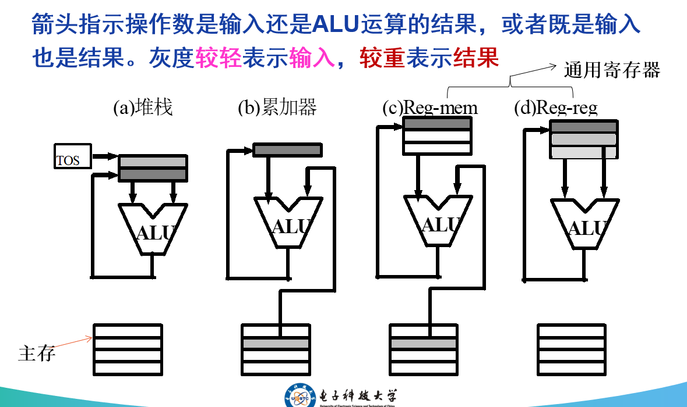
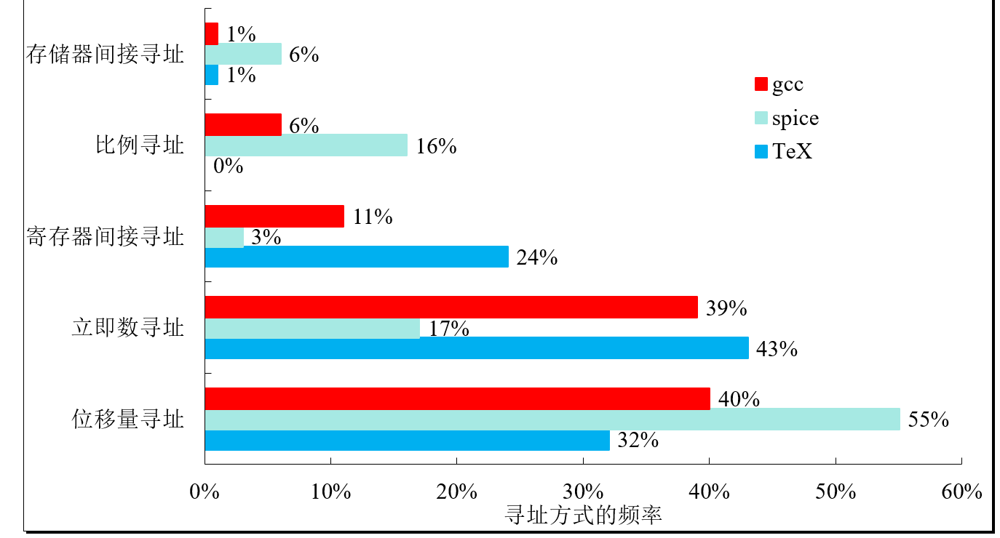

## **2.1 简介**

本节回顾了第一章中提到的三大应用领域，并从**指令集系统 (ISA)** 的角度分析了它们各自的设计侧重点。

#### 一、 三大应用领域的指令集需求

1.  **桌面/科学计算领域**:
    -   注重**定点和浮点运算性能**。
    -   不注重程序（代码）大小及处理器功耗。

2.  **服务器领域**:
    -   主要应用于数据库、文件服务器、Web应用。
    -   注重**定点和字符串处理**性能。
    -   有浮点指令，但其性能不是关键。

3.  **嵌入式领域**:
    -   注重**成本、功耗和代码大小**。
    -   一些复杂指令（如浮点指令）通常作为**可定制的选项**，以控制成本。

#### 二、 核心结论与本章重点

-   **指令集的相似性**: 尽管这三个领域的侧重点不同，但它们的**指令系统仍然非常相似**，共享一个核心基础。

-   **本章学习重点**: 正因为这种相似性，**MIPS 指令集**成为了一个经典的教学和研究案例，因为它在**桌面、服务器和嵌入式**这三个领域中都有着广泛的应用。本章将以 MIPS 为例展开学习。

## **2.2 指令集系统结构的分类**

#### 一、 分类的根本区别

**指令集系统结构 (ISA)** 最根本的区别在于**处理器内部数据的存储结构不同**。这种存储结构决定了指令如何指定其操作数。

-   **内部存储结构**: 主要分为**堆栈 (Stack)**、**累加器 (Accumulator)** 或**一组通用寄存器 (a set of general-purpose registers)**。
-   **操作数指定方式**:
    -   **隐式指定 (Implicit)**: 指令的操作数位置是约定俗成的，不需要在指令中明确指出。
    -   **显式指定 (Explicit)**: 指令中必须明确指出操作数所在的寄存器或内存地址。

#### 二、 四种主要的 ISA 类型

根据内部存储结构，ISA 主要可以分为以下四种类型：

##### (1) 堆栈体系结构 (Stack Architecture)
-   **工作原理**: 所有ALU操作的操作数都**隐式地**位于**栈顶**。
-   **数据流**:
    1.  两个操作数从栈顶弹出，送入ALU。
    2.  ALU进行运算。
    3.  运算结果被压回栈顶。
-   **内存交互**: 通过 `Push`（压栈）和 `Pop`（弹栈）指令与主存进行数据交换。
-   **特点**: 指令非常紧凑，但难以进行乱序执行等优化。

##### (2) 累加器体系结构 (Accumulator Architecture)
-   **工作原理**: 其中一个操作数**隐式地**是**累加器 (Accumulator)** 这个专用寄存器。
-   **数据流**:
    1.  一个操作数来自累加器，另一个来自主存。
    2.  ALU进行运算。
    3.  运算结果**隐式地**存回累加器。
-   **特点**: 指令简单，但累加器成为性能瓶颈，内存流量较大。

##### (3) 寄存器-存储器体系结构 (Register-Memory Architecture)
-   **工作原理**: 操作数被**显式指定**。ALU操作允许一个操作数在寄存器中，另一个在主存中。
-   **数据流**:
    1.  一个操作数来自寄存器，一个来自主存。
    2.  ALU进行运算。
    3.  运算结果存回寄存器。
-   **特点**: 指令格式更复杂，操作数长度不一，不利于流水线设计。

##### (4) 寄存器-寄存器 (Load-Store) 体系结构 (Register-Register or Load-Store Architecture)
-   **工作原理**: 所有ALU操作的操作数都必须**显式地**位于**通用寄存器**中。
-   **数据流**:
    1.  所有操作数都来自寄存器。
    2.  ALU进行运算。
    3.  运算结果存回寄存器。
-   **内存交互**: 只能通过专门的 `Load` (从内存加载到寄存器) 和 `Store` (从寄存器存储到内存) 指令与主存交互。
-   **特点**: 指令格式规整，执行速度快，易于编译器优化和硬件流水线设计。**现代大多数RISC处理器采用此架构**。

#### 三、 示例：`C = A + B` 在四种架构中的实现

假设变量 A、B、C 都在存储器中，且 A 和 B 的值在运算后不被破坏。

| (a) 堆栈 (Stack) | (b) 累加器 (Accumulator) | (c) 寄存器-存储器 (Reg-Mem) | (d) 寄存器-寄存器 (Load-Store) |
| :--------------- | :----------------------- | :-------------------------- | :----------------------------- |
| `Push A`         | `Load A`                 | `Load R1, A`                | `Load R1, A`                   |
| `Push B`         | `Add B`                  | `Add R1, B`                 | `Load R2, B`                   |
| `Add`            | `Store C`                | `Store R1, C`               | `Add R3, R1, R2`               |
| `Pop C`          |                          |                             | `Store R3, C`                  |

> **堆栈是一个逻辑概念，它的物理实现是一个混合体：主体在慢速的主存中，但最常被访问的栈顶部分被缓存在CPU内部速寄存器中，以实现高性能计算。**

-   **TOS 是什么？**: TOS (Top of Stack) 在硬件层面指的是**一组用于缓存栈顶元素的高速CPU寄存器**，并由一个**栈顶指针**来管理。
-   **结果放回哪里？**: ALU 的运算结果会**优先放回这些高速的栈顶寄存器**，而不是立即放回主存。
-   **为什么这么做？**: 这种设计是为了**性能优化**。通过将频繁访问的栈顶数据保留在CPU内部，可以避免与慢速主存进行不必要的交互，从而显著提升连续计算的速度。

##### **通用寄存器体系结构的两种划分**

按照**通用寄存器**访问内存的方式，可以进一步将通用寄存器体系结构划分为两种主要类型：

1.  **寄存器-存储器 (register-memory) 体系结构**:
    -   **特点**: **一般指令都可以访问存储器**。这意味着像 `ADD`, `SUB` 这样的算术逻辑指令，其操作数之一可以直接是内存地址。
    -   *示例*: `ADD R1, memory_address` (将寄存器R1的值与内存地址`memory_address`的值相加，结果存回R1)。

2.  **寄存器-寄存器 (register-register) 或 load-store 体系结构**:
    -   **特点**: **只有`load`和`store`指令才能访问内存**。所有的算术逻辑指令（如`ADD`, `SUB`）的操作数必须全部在寄存器中。
    -   **工作流程**:
        1.  使用 `load` 指令将数据从内存加载到寄存器。
        2.  在寄存器之间进行计算。
        3.  使用 `store` 指令将结果从寄存器写回内存。

##### **其他相关体系结构**

-   **纯粹的 memory-memory 体系结构**:
    -   这是一种理论上的结构，其所有操作数都保存在存储器中。
    -   **现实中不存在**这样的纯粹结构，因为它效率极低。

-   **扩展累加器 (Extended Accumulator) 计算机**:
    -   这是一种混合型结构，它在传统的**累加器**之外，又扩展了一些其他的寄存器，以提高灵活性和性能。

#### 

#### 四、 核心总结

-   在**堆栈结构**和**累加器结构**中，`Add` 指令的操作数是**隐式的**（由栈顶指针或累加器决定）。
-   而在两种**寄存器结构**中，`Add` 指令的操作数都必须**显式地**指定。
-   `Load-Store` 架构将**计算**和**访存**操作完全分离，是现代处理器设计的主流。

#### 五、 通用寄存器 (GPR) 体系结构

通用寄存器架构是现代计算机的主流，它克服了堆栈和累加器架构的瓶颈。

##### 1. 通用寄存器出现的原因
-   **速度优势**: **寄存器比存储器快得多**。将常用数据放在寄存器中能显著提升性能。
-   **编译器优化**: 编译器使用寄存器比使用其他存储形式（如堆栈）**更方便、效率更高**。
    -   *示例*: 对于表达式 `(A*B) - (C*D) - (E*F)`，在寄存器架构中，编译器可以按**任意顺序**执行三个乘法，灵活性高。而在堆栈架构中，计算顺序是固定的，且可能需要多次加载数据。
-   **减少内存流量，改善代码密度**:
    -   用寄存器存放变量，减少了对慢速主存的访问次数，**加速程序运行**。
    -   寄存器地址比存储器地址的**位数少**得多（如5位 vs 32位），使得指令更短，**改善了代码密度**。

##### 2. 通用寄存器ISA的两个关键特性
通用寄存器ISA在设计运算类指令时，主要有两个维度的考量：

1.  **ALU指令中包含两个还是三个操作数？**
    -   **三操作数格式**: `ADD R1, R2, R3`  (R1 = R2 + R3)
        -   一个结果（目的）操作数，两个源操作数。
    -   **二操作数格式**: `ADD R1, R2`  (R1 = R1 + R2)
        -   一个操作数既是源操作数，也是结果操作数。
2.  **ALU指令中包含多少个存储器操作数？**
    -   ALU指令中支持的存储器操作数数量可以是 **0 到 3 个**不等。

#### 六、 基于寄存器ISA的详细分类

根据上述两个特性，通用寄存器体系结构可以进一步细分为三类：

| 存储器地址个数 | 最多操作数个数 | 系统结构类型                  | 举例                                      |
| :------------- | :------------- | :---------------------------- | :---------------------------------------- |
| **0**          | **3**          | **Load-Store (Reg-Reg)**      | **Alpha, ARM, MIPS, PowerPC, SPARC**      |
| **1**          | **2**          | **Register-Memory (Reg-Mem)** | IBM360/370, **Intel x86**, Motorola 68000 |
| **2 或 3**     | **2 或 3**     | **Memory-Memory (Mem-Mem)**   | **VAX** (同时支持2操作数和3操作数格式)    |

*注：纯粹的 Memory-Memory 架构（所有操作数都在内存）在现实中不存在。*

#### 七、 三种常见通用寄存器计算机的优缺点

| 类型                                                   | 优点                                                         | 缺点                                                         |
| :----------------------------------------------------- | :----------------------------------------------------------- | :----------------------------------------------------------- |
| **Reg-Reg (Load-Store)**   (0个内存地址, 3个操作数) | - **简单、定长的指令编码** - 简单的代码生成模式 - **每条指令运行的时钟周期数相近** (利于流水线) | - 目标代码**指令数比直接访问存储器的结构多** - 指令多和指令密度低使得程序变得很大 |
| **Reg-Mem**   (1个内存地址, 2个操作数)              | - 数据**不需要专门的载入指令**就可以直接访问 - 指令格式更易于编码，**代码密度高** | - **源操作数在二元操作中被破坏** (R1=R1+Mem)，操作数不等价 - 在一条指令中同时对存储器地址和寄存器号进行编码，会**限制寄存器的数量** - 操作数位置不同，使得每条指令执行所需的**时钟周期不同** |
| **Mem-Mem**   (2或3个内存地址)                      | - **最紧凑** - 不浪费寄存器来做临时交换空间               | - 指令**长短不相同**，特别是三操作数指令 - 每条指令的操作各不相同 - **存储器访问带来了存储器瓶颈** |

*注：此外，还有一种在累加器基础上扩展了其他寄存器的**扩展累加器**计算机。*

#### **1. Reg-Reg (Load-Store) 架构**

这是“米其林大厨”模型，纪律严明，追求极致效率。

##### **优点**

*   **简单、定长的指令编码:**
    *   **为什么成立？** 因为所有计算指令的操作数都是寄存器。一个CPU的寄存器数量是固定的且很少（比如32个）。要指定一个寄存器，只需要很少的几位（`2^5=32`，所以5位就够了）。因此，一条指令如 `ADD R1, R2, R3` 可以被编码成一个固定长度的二进制串，例如 `[操作码 | 目的R1 | 源R2 | 源R3]`。这种规整性使得CPU的**指令解码**硬件非常简单和快速。
    *   **比喻:** 厨师的菜谱上，每个步骤都印在格式完全相同的卡片上。第一格写操作（如“混合”），后面三格永远是写工作台上的碗的编号。读取和理解这种卡片非常快。

*   **每条指令运行的时钟周期数相近:**
    *   **为什么成立？** 因为指令被分解成了最简单的原子操作：要么只在工作台上计算（`ADD`），要么只负责搬运（`LOAD/STORE`）。这些简单操作的执行时间非常**可预测**。这种可预测性是实现**高效流水线**（Pipelining）的基石。CPU可以像工厂流水线一样，同时处理多条指令的不同阶段，从而极大地提升性能。
    *   **比喻:** 流水线上的每个工人只做一个简单、耗时固定的动作（一个切菜、一个混合、一个装盘）。整个流水线可以高速运转，不会因为某个工人突然要花很长时间去储藏室而卡住。

##### **缺点**

*   **目标代码指令数比直接访问存储器的结构多:**
    *   **为什么成立？** 因为计算和访存是分离的。要完成一个在内存中的计算 `C = A + B`，你必须显式地执行4条指令：`LOAD A -> R1`, `LOAD B -> R2`, `ADD R1, R2 -> R3`, `STORE R3 -> C`。而其他架构可能只需要1或2条指令。
    *   **比喻:** 米其林大厨的菜谱步骤非常详细繁琐：“第一步，从储藏室拿面粉到1号碗。第二步，从储藏室拿水到2号碗...” 等等。步骤数量很多。

*   **指令多和指令密度低使得程序变得很大:**
    *   **为什么成立？** 这是上一个缺点的直接后果。更多的指令意味着最终编译出来的程序文件体积更大。在几十年前，内存和磁盘空间极其宝贵，这是一个非常严重的缺点。但在今天，存储成本极低，这个缺点的影响已经大大减小。
    *   **比喻:** 详细的菜谱需要一本很厚的书来记录，占用了书架（内存/磁盘）的更多空间。

---

#### **2. Reg-Mem 架构**

这是“务实的家常菜大厨”模型，在效率和便利性之间寻找平衡。

##### **优点**

*   **数据不需要专门的载入指令就可以直接访问:**
    *   **为什么成立？** 指令 `ADD R1, [Memory_B]` 将“加载B”和“与R1相加”两个步骤合并成了一个。这减少了程序员（或编译器）需要写的指令数量。
    *   **比喻:** 厨师可以一边用右手搅动工作台上的碗（寄存器），一边用左手直接从旁边的冰箱（内存）里拿一个鸡蛋加进去。动作更连贯，步骤更少。

*   **指令格式更易于编码，代码密度高:**
    *   **为什么成立？** 因为指令数量减少了，所以程序的总体积自然就变小了。这在存储空间受限的时代是一个巨大的优势。
    *   **比喻:** 家常菜谱更简洁：“把鸡蛋加入面粉中混合”。比米其林菜谱的书要薄得多。

##### **缺点**

*   **源操作数在二元操作中被破坏:**
    *   **为什么成立？** 这种架构通常采用二操作数格式。在 `ADD R1, R2` 中，`R1` 的原始值被 `R1+R2` 的结果覆盖了。如果之后还需要用到`R1`的原始值，就必须提前用一条额外的指令把它备份起来，这有时会抵消其代码密度高的优势。
    *   **比喻:** 厨师把鸡蛋直接打进了面粉碗里。现在你再也拿不到那个“纯面粉”的状态了。

*   **限制寄存器的数量:**
    *   **为什么成立？** 这是个非常精妙的硬件限制。一条指令的长度（比如32位）是有限的。在这条指令中，你既要编码**操作码**，又要编码**寄存器号**，还要编码一个可能非常长的**内存地址**。内存地址本身会占用大量位数，留给指定寄存器号的位数就非常少了。比如只剩3位，那最多就只能支持 `2^3=8` 个寄存器。而Reg-Reg架构因为没有内存地址，可以奢侈地用5位来支持32个寄存器。
    *   **比喻:** 在一张小小的便签上写指令，如果你要花大量空间写清楚储藏室里一个东西的详细位置，那就只剩下很少的空间来写工作台上碗的编号了。

*   **每条指令执行所需的时钟周期不同:**
    *   **为什么成立？** `ADD R1, R2` (两个都是寄存器) 执行得飞快。而 `ADD R1, [Memory]` 的执行时间则完全**不可预测**——它取决于数据是在高速缓存里（快）还是在主内存里（极慢）。这种巨大的不确定性，对CPU流水线是致命的打击，会导致流水线频繁地停顿和等待。
    *   **比喻:** 厨师流水线被卡住了。因为当前这个工人的指令是“去遥远的地下室仓库取一瓶酱油”，在他回来之前，后面的所有人都得停下来等他。

---

#### **3. Mem-Mem 架构**

这是“魔法大厨”模型，追求用最少的指令做最复杂的事。

##### **优点**

*   **最紧凑:**
    *   **为什么成立？** `C = A + B` 可以被压缩成一条指令 `ADD [C], [A], [B]`。这是代码密度的极致。
    *   **比喻:** 菜谱只有一句话：“变出一份意大利面”。书薄到只有一页纸。

*   **不浪费寄存器来做临时交换空间:**
    *   **为什么成立？** 因为所有操作都直接在内存中发生，理论上你根本不需要寄存器来临时存放中间结果。
    *   **比喻:** 魔法厨师不需要工作台。所有食材都在储藏室里自动混合。

##### **缺点**

*   **指令长短不相同:**
    *   **为什么成立？** 一条指令可能需要编码2个或3个完整的内存地址，这使得指令本身变得非常长。而另一条指令可能只是简单的寄存器操作，长度很短。CPU获取和解码这种变长指令的逻辑会变得异常复杂。
    *   **比喻:** 菜谱里的指令，一句是“搅拌”，下一句是一整页纸，详细描述了三个地点的魔法坐标。阅读起来非常费劲。

*   **存储器访问带来了存储器瓶颈:**
    *   **为什么成立？** 这是它的**致命伤**。CPU的速度比内存快成百上千倍。如果每条指令都要去缓慢的内存中读写两三次数据，那么CPU绝大部分时间都在**等待**内存响应。CPU和内存之间的数据通道（总线）会发生严重的交通堵塞。这被称为“**内存墙**”问题。
    *   **比喻:** 魔法厨师施法速度快如闪电，但每次施法都需要从遥远的储藏室传来原料，再把成品传送回去。结果他99.9%的时间都在发呆，等待传送带慢慢悠悠地把东西运来运去。整个厨房的效率被传送带的速度给限制死了。

## **2.3 存储器寻址**

本节讨论了计算机如何访问内存中的数据，包括数据的基本单位、存储顺序、对齐方式以及定位操作数的各种方法。

### 一、 基本寻址单位与数据类型

-   **字节寻址 (Byte Addressing)**: 现代计算机的内存都被组织成以**字节 (Byte, 8位)** 为基本单位的线性地址空间。地址 `0` 对应第一个字节，地址 `1` 对应第二个字节，以此类推。
-   **支持的数据类型**: 除了基本的字节寻址，指令系统还提供了对更大单位数据的直接寻址支持：
    -   **半字 (Half word)**: 16位
    -   **字 (Word)**: 32位
    -   **双字 (Double word)**: 64位
-   **寻址方式**: 访问一个“字”时，地址会以4为步长递增（0, 4, 8, ...），因为一个字包含4个字节。

### 二、 字节序：大端模式 (Big-Endian) 与小端模式 (Little-Endian)

当一个多字节数据（如一个字）存放在内存中时，其内部字节的排列顺序存在两种模式。

-   **小端模式 (Little-Endian)**: **低地址存放低字节 (L**ow address, **L**ow byte)。
    -   将一个字的最低有效字节 (Least Significant Byte, LSB) 存放在起始的最低地址处。
    -   *例如*: `0xABCD` 存放在地址 `1000`，则内存中 `1000` 存 `CD`，`1001` 存 `AB`。

-   **大端模式 (Big-Endian)**: **低地址存放高字节 (L**ow address, **H**igh byte)。
    -   将一个字的最高有效字节 (Most Significant Byte, MSB) 存放在起始的最低地址处。
    -   *例如*: `0xABCD` 存放在地址 `1000`，则内存中 `1000` 存 `AB`，`1001` 存 `CD`。

### 三、 内存对齐 (Memory Alignment)

-   **定义**: 如果一个 `s` 字节数据的存放地址 `A` 能够满足 `A mod s = 0`，则称这次访问是**对齐的 (Aligned)**。
    -   `2字节` (半字) 数据，其地址应为 `2` 的倍数 (地址二进制末位为0)。
    -   `4字节` (字) 数据，其地址应为 `4` 的倍数 (地址二进制末两位为00)。
    -   `8字节` (双字) 数据，其地址应为 `8` 的倍数 (地址二进制末三位为000)。

-   **为什么需要对齐**:
    1.  **简化硬件**: 许多系统硬件被设计为一次只能从对齐的地址边界读取一个字或双字。对齐访问可以**简化硬件实现的复杂性**。
    2.  **提升性能**: **一次不对齐的存储器访问，可能会导致硬件需要进行多次对齐的存储器访问**。例如，要从地址 `1` 读取一个字 (4字节)，硬件可能需要先读取地址 `0` 处的字，再读取地址 `4` 处的字，然后通过移位和拼接操作才能得到想要的数据。
    -   **结论**: 即使在没有强制对齐限制的计算机里，**对齐访问的程序也会运行得比较快**。

-   **对齐的代价**:
    -   **优点**: 提升了访存性能。
    -   **缺点**: 为了让每个变量都对齐，编译器可能会在变量之间插入一些**填充字节 (Padding)**，从而**浪费存储空间**。
    -   **权衡**: **目前来看，浪费一点存储空间来换取性能提升是完全值得的。**

### 四、 寻址方式 (Addressing Modes)

-   **定义**: 指令中如何指定所要访问操作数的地址。寻址方式要指定**常量**、**寄存器**和**存储器**操作数的位置。

-    *** 立即数通常也被认为是一种存储器寻址方式（尽管它们要访问的数值在指令流里）。**

     ***** **寄存器不属于存储器寻址。**

     ***** **把依赖于程序计数器的PC相对寻址（后面详细讨论）也分离出来。**

-   **常见寻址方式汇总**:

| 寻址方式           | 指令举例              | 含义 (语义)                                                  | 何时使用                             |
| :----------------- | :-------------------- | :----------------------------------------------------------- | :----------------------------------- |
| **寄存器寻址**     | `Add R4, R3`          | `Regs[R4] ← Regs[R4] + Regs[R3]`                             | 操作数在寄存器中                     |
| **立即数寻址**     | `Add R4, #3`          | `Regs[R4] ← Regs[R4] + 3`                                    | 数值是常量                           |
| **位移量寻址**     | `Add R4, 100(R1)`     | `Regs[R4] ← Regs[R4] + Mem[100 + Regs[R1]]`                  | 存取局部变量 (模拟栈指针+偏移)       |
| **寄存器间接寻址** | `Add R4, (R1)`        | `Regs[R4] ← Regs[R4] + Mem[Regs[R1]]`                        | 使用指针或计算出的地址进行寻址       |
| **间接寻址**       | `Add R3, [R1+R2]`     | `Regs[R3] ← Regs[R3] + Mem[Regs[R1] + Regs[R2]]`             | 有用在数组寻址中                     |
| **索引寻址**       | `Add R1, (1001)`      | `Regs[R1] ← Regs[R1] + Mem[1001]`                            | 存取静态数据                         |
| **存储器间接寻址** | `Add R1, @(R3)`       | `Regs[R1] ← Regs[R1] + Mem[Mem[Regs[R3]]]`                   | 如果R3是指针p的地址, 那么就得到*p    |
| **自动递增寻址**   | `Add R1, (R2)+`       | `Regs[R1] ← Regs[R1] + Mem[Regs[R2]]; Regs[R2] ← Regs[R2] + d` | 在循环中递增变量，R2是数组的起始地址 |
| **自动递减寻址**   | `Add R1, -(R2)`       | `Regs[R2] ← Regs[R2] - d; Regs[R1] ← Regs[R1] + Mem[Regs[R2]]` | 类似堆栈的push/pop功能               |
| **比例寻址**       | `Add R1, 100(R2)[R3]` | `Regs[R1] ← Regs[R1] + Mem[100 + Regs[R2] + Regs[R3]*d]`     | 用来进行数组寻址                     |

#### **寻址方式的使用频率分析**

##### 一、 测试背景与目的

-   **测试平台**: 选用 **VAX 系统结构**的计算机进行测试。
-   **选择VAX的原因**:
    1.  **寻址方式丰富**: VAX 是一个典型的 CISC 架构，提供了非常全面和复杂的寻址方式，适合进行广泛的统计。
    2.  **限制很少**: VAX 对存储器寻址的限制很少，允许研究人员观察程序在“最自由”的情况下会倾向于使用哪些寻址方式。
-   **测试程序**: 选取了三个有代表性的程序进行测试：`gcc` (编译器)、`spice` (电路模拟)、`TeX` (排版系统)。
-   **统计范围**: 统计了程序中各种**存储器寻址方式**的使用频率（不包括纯粹的寄存器寻址）。

##### 二、 核心统计结果与洞察

统计图表直观地揭示了，尽管存在多种复杂的寻址方式，但程序实际高频使用的寻址方式非常集中。

-   **最常用的寻址方式**:
    1.  **位移量寻址 (Displacement)**: 在所有三个程序中都占据了极高的比例 (32% ~ 55%)。
    2.  **立即数寻址 (Immediate)**: 同样是使用频率最高的寻址方式之一 (17% ~ 43%)。

-   **次要的寻址方式**:
    -   **寄存器间接寻址 (Register Deferred/Indirect)**: 具有一定的使用率，尤其在 `TeX` 中较为常用 (24%)。
    -   **比例寻址 (Scaled)**: 在科学计算程序 `spice` 中使用较多 (16%)，但在其他程序中几乎不用或很少使用。

-   **罕用的寻址方式**:
    -   **存储器间接寻址 (Memory Indirect)** 等更复杂的寻址方式，其使用频率非常低 (通常在 1% 左右)。

#### **位移量寻址方式 **

位移量寻址是现代计算机中使用最频繁的存储器寻址方式之一。其核心设计问题在于如何选择一个合适的**位移量 (Displacement)** 长度。

##### 具体设计

**一、 核心公式**

位移量寻址的本质是**通过一个已知的“基准点”加上一个固定的“偏移”来定位数据**。其计算有效地址 (Effective Address) 的公式为：
`有效地址 = 基址寄存器 (Base Register) 的内容 + 位移量 (Displacement / Offset)`

**二、 关键组成部分**

1.  **基址寄存器 (Base Register)**:
    -   这是一个通用寄存器，其内容是一个内存地址。
    -   这个地址扮演着一个数据区域的“基准点”或“起始点”的角色。常见的基准点有：
        -   **栈帧指针 (FP/SP)**: 指向当前函数局部变量区域的起点。
        -   **全局数据指针 (GP)**: 指向全局变量区域的起点。
        -   **数据结构指针**: 指向一个结构体或数组的起始地址。

2.  **位移量 / 偏移 (Displacement / Offset)**:
    -   **定义**: 这是一个直接编码在指令中的**常量值**。
    -   **作用**: 它表示目标数据距离基准点有多远。
    -   在这个语境下，**“位移量”** 和 **“偏移”** 是可以互换使用的同义词。

**三、 位移量是如何确定的？**

位移量并非在程序运行时动态计算，而是在**编译阶段 (Compile Time)** 由**编译器**静态计算并确定的。

编译器在内存中组织程序的数据布局时，就已经精确规划好了每个变量相对于其基准点的相对位置（即偏移）。

-   **示例1：访问结构体成员**
    -   如果一个结构体的起始地址存放在基址寄存器 `R1` 中，那么访问该结构体的某个成员时，所用的**位移量**就是该成员在结构体定义中的**字节偏移**。例如，访问偏移为8字节的成员，位移量就是`8`。

-   **示例2：访问局部变量**
    -   函数的局部变量存放在栈帧中，其位置相对于**帧指针(FP)**是固定的。编译器会计算出每个局部变量相对于 `FP` 的**负偏移**，并将其作为**位移量**编码到指令中。

##### 一、 设计考量

-   **核心问题**: 位移量的**范围**应该是多大？即在指令中应该分配多少位 (bits) 来表示这个位移量。
-   **设计权衡**:
    -   **更长的位移量**:
        -   **优点**: 可以一次性访问距离基址寄存器更远的数据，无需额外指令。
        -   **缺点**: 会占用指令中更多的位数，导致**指令长度变长**，或者挤占其他字段（如操作码、寄存器号）的空间。
    -   **更短的位移量**:
        -   **优点**: 指令编码更紧凑，节省指令空间。
        -   **缺点**: 当需要访问较远的数据时，可能需要多条指令来构造地址，降低了程序效率。

-   **结论**: 选择位移量的长度会**直接影响指令的长度**和架构的整体效率，是一个关键的设计决策。

##### 二、 Alpha 架构上的测试与数据分析

为了科学地做出决策，研究人员在 **Alpha 架构**（其指令提供 **16位** 位移量）上运行了 `SPEC CPU2000` 的整数 (CINT2000) 和浮点 (CFP2000) 测试程序集，统计了访存指令中实际使用的位移量值的分布情况。

-   **图表分析**:
    -   **横轴**: 位移量所需的位数（例如，`4` 表示位移量值在 `±2³` 到 `±2⁴-1` 之间）。
    -   **纵轴**: 该范围的位移量在所有位移量寻址中被使用的频率。
-   **核心观察**:
    1.  **绝大多数位移量都很小**: 统计图显示，绝大部分（通常超过50%）的位移量值都非常小，只需要很少的位数（如0-7位）就能表示。这主要对应于对**栈帧 (stack frame)** 中局部变量的访问。
    2.  **存在对较大位移量的需求**: 图中也清晰地显示，在需要 **12 到 15 位**才能表示的较大位移量范围内，同样存在一个显著的使用高峰。这通常对应于对**全局数据区 (global data area)** 变量的访问。
    3.  **分布范围很广**: 总体来看，位移量值的分布范围很广，从非常小到接近16位所能表示的极限都有涉及。这是由于程序的存储布局、存取方式以及编译器选择的不同策略共同导致的。

##### 三、 最终结论

-   **关键结论**: 从统计数据来看，为了能够高效地覆盖绝大多数常用场景（特别是对全局数据的访问），**提供 12 到 16 位的位移量是必要的**。
-   **设计采纳**: 基于类似的研究，许多现代RISC架构都做出了相似的设计选择。例如，**MIPS 架构就采用了 16 位的位移量**，这被证明是一个在指令长度和寻址范围之间取得了良好平衡的有效设计。

#### **立即数寻址方式**

立即数寻址是将常量值直接编码在指令中的一种高效寻址方式。其核心设计问题与位移量寻址类似，即如何选择一个合适的立即数长度。

##### 一、 设计考量与应用场景

-   **核心问题**: **立即数的范围**应该是多大？这同样会直接影响**指令的长度**和架构效率。
-   **应用场景**: 立即数寻址常用于：
    -   **算术运算指令**: 如 `ADD R1, R1, #5` (将 R1 的值加 5)。
    -   **载入常数到寄存器**: 如 `LI R2, #1024` (将 1024 载入 R2)。
    -   **比较指令**: 用于条件转移指令中的判断条件，如 `BEQ R1, #0, Label` (如果 R1 等于 0，则跳转)。
-   **关键设计决策**: 指令集是应该**支持所有操作**都使用立即数，还是**只支持一部分常用操作**？这个决策对指令系统的设计很重要。

##### 二、 Alpha 架构上的测试与数据分析

为了确定需要多大的立即数，研究人员在 **Alpha 架构**（最大支持 **16位** 立即数）上运行了 `SPEC CPU2000` 测试集，统计了实际使用的立即数值的分布情况。

-   **图表分析**:
    -   **X轴**: 表示一个立即数值所需要的位数（例如，`4` 表示该立即数的值在 `2³` 到 `2⁴-1` 之间，`0` 表示值为0）。
    -   **Y轴**: 该范围的立即数在所有立即数寻址中被使用的频率。
-   **核心观察**:
    1.  **小立即数最常用**: 无论是定点还是浮点程序，**小数值的立即数**（如0、1等，仅需少量位数表示）使用得**最最频繁**。
    2.  **存在对大立即数的需求**: 尽管小立即数占主导，但程序中有时也会使用较大的立即数，特别是在**寻址计算**中。
    3.  **定点与浮点的差异**:
        -   **定点程序 (CINT)**: 立即数使用频率的分布相对平缓，对各种大小的立即数都有需求。
        -   **浮点程序 (CFP)**: 立即数的使用**高度集中**在非常小的数值上（如图中 `4` 对应的峰值，高达 `42%`）。

##### 三、 综合分析与最终结论

-   **正负数分布**: 大多数立即数是正值。在 `CINT2000` 中约有 `20%` 的立即数是负数，在 `CFP2000` 中约为 `30%`。
-   **与VAX的对比**: 在一台支持32位立即数的VAX计算机上进行相同测试，结果显示有 **20%~25%** 的立即数**大于16位**。
    -   **推论**:
        -   支持**16位及以下**的立即数可以覆盖约 **80%** 的场景。
        -   支持**8位及以下**的立即数可以覆盖约 **50%** 的场景。
-   **最终结论**: 为了在指令长度和功能覆盖率之间取得良好平衡，**提供 8~16 位的立即数是必要的**。
-   **设计采纳**: 基于此结论，现代RISC架构如 **MIPS** 和 **ALPHA** 都采用了 **16位** 的立即数设计。

##### 四、 立即数使用频率
-   大约有 **1/4** 的数据传输和定点ALU操作包含一个立即数操作数。
-   在 `SPEC2000` 测试中，定点程序中有约 **1/5** (20%) 的指令用到了立即数，在浮点程序中这个比例约为 **1/6** (~17%)。

### **寻址方式小结**

-   **一般ISA支持的基本寻址方式**:
    -   根据对程序行为的统计分析，现代指令集（ISA）通常会优先支持以下几种最常用、最高效的寻址方式：
        1.  **立即数寻址 (Immediate Addressing)**
        2.  **位移量寻址 (Displacement Addressing)**
        3.  **寄存器间址 (Register Indirect Addressing)**

-   **立即数与位移量的推荐长度**:
    -   为了在指令编码的紧凑性和寻址能力的覆盖范围之间取得良好平衡，推荐的设计值为：
        -   **立即数**: 支持 **8 ~ 16 位**。
        -   **位移量**: 支持 **12 ~ 16 位**。
    -   这个范围能够覆盖绝大多数程序（超过80%）的访存和常量使用需求。

## **2.4 操作数的大小与类型**

本节讨论了指令系统如何定义和区分不同大小和类型的操作数，以及在实际程序中各种数据类型的访问频率。

#### 一、 操作数类型的指定方式

计算机硬件需要知道如何解释内存中的二进制位串（例如，一个32位的数据究竟是整数还是浮点数）。指令系统通过以下两种方式来指定操作数的类型：

1.  **通过操作码 (Opcode) 的编码来指定**:
    -   **描述**: 这是**最常用**的方法。指令的操作码本身就隐含了操作数的数据类型。
    -   **示例**: `ADD` 指令可能用于整数加法，而 `ADD.S` (或 `FADD`) 指令则专门用于单精度浮点数加法。硬件通过解码 `ADD` 或 `ADD.S` 就能知道该如何处理后续的操作数。

2.  **通过操作数中用硬件解释的字段来表示**:
    -   **描述**: 数据本身带有一个“标签 (Tag)”字段，用来表明其数据类型。硬件在处理数据前会先检查这个标签。
    -   **应用**: 这种方法不常见，主要用于一些特殊的、支持动态类型的体系结构中。

#### 二、 常见的数据类型、大小与表示

下表列出了现代计算机中常见的操作数类型及其属性：

| 数据类型             | 位数 | 数值范围                      | C 语言中的对应       |
| :------------------- | :--- | :---------------------------- | :------------------- |
| **字节 (Byte)**      | 8    | `-128` ~ `+127`               | `signed char`        |
| **无符号字节**       | 8    | `0` ~ `255`                   | `unsigned char`      |
| **半字 (Half word)** | 16   | `-32768` ~ `+32767`           | `short int`          |
| **无符号半字**       | 16   | `0` ~ `65535`                 | `unsigned short int` |
| **字 (Word)**        | 32   | `-2147483648` ~ `+2147483647` | `int`                |
| **无符号字**         | 32   | `0` ~ `4294967295`            | `unsigned int`       |
| **单精度浮点数**     | 32   | -                             | `float`              |
| **双精度浮点数**     | 64   | -                             | `double`             |

-   **编码格式**:
    -   **定点数** (整数) 通常用**二进制补码**表示。
    -   **字符**通常是 **ASCII** 编码格式。

#### 三、 实际程序中数据访问的大小分布

通过在 **64位处理器**上运行基准测试程序，可以统计出不同大小数据的访问频率，从而指导体系结构的设计。

-   **统计图分析**:
    -   **浮点程序 (平均值)**:
        -   **双字 (64位)** 访问占绝对主导，高达 **70%**。
        -   **字 (32位)** 访问占 `29%`。
        -   半字和字节访问非常少。
    -   **定点程序 (平均值)**:
        -   **双字 (64位)** 访问同样是主流，占 **59%**。
        -   **字 (32位)** 访问占 `26%`。
        -   **字节 (8位)** 访问占 `10%`。
        -   半字访问最少。

-   **数据解读与分析**:
    1.  **64位系统中的双字访问**:
        -   在**浮点程序**中，双字访问主要对应于**双精度 (double) 浮点数**的运算。
        -   在**定点程序**中，双字访问主要对应于**存储器地址**的计算和访问 (因为在64位系统中，指针是64位的)。
    2.  **在32位系统中的变化**:
        -   如果在 **32位地址**的计算机上进行相同测试，情况会发生显著变化。
        -   由于指针变为32位，定点程序中几乎所有的**双字访问都将转换成单字访问**。
    3.  **对寄存器内部的访问**:
        -   在一些体系结构中（如VAX），允许以字节或半字为单位访问一个寄存器的部分内容。
        -   然而，这种用法**非常罕见**。统计表明，在VAX上这类访问不超过所有寄存器访问的 `12%`，大约占所有操作数访问的 `6%`。

#### 四、 核心结论

-   在现代64位系统中，无论是定点还是浮点程序，**对64位（双字）和32位（字）数据的访问占据了绝对主导地位**。
-   体系结构的设计应该**优先优化**对这两种最常用数据类型的处理效率。
-   对字节和半字的访问虽然存在，但频率较低，可以作为次要的优化目标。

## **2.5 指令系统的操作**

本节对指令系统中包含的操作类型进行了分类，并分析了各类指令在实际程序中的使用频率。

#### 一、 指令操作类型的分类

指令系统提供的操作可以根据其功能大致分为以下几类：

| 操作类型           | 举例                                                 |
| :----------------- | :--------------------------------------------------- |
| **算术和逻辑运算** | **定点算术和逻辑操作**: 加、减、与、或、乘、除       |
| **数据传输**       | **Load-store指令** (在REG-MEM结构计算机上是传送指令) |
| **控制**           | 条件转移、跳转、过程调用和返回、陷阱 (Trap)          |
| **系统**           | 操作系统调用、虚拟存储器管理指令                     |
| **浮点**           | 浮点操作: 加、减、乘、除、比较                       |
| **十进制**         | 十进制加、十进制乘、十进制到字符的转换               |
| **字符串**         | 字符串传送、字符串比较、字符串匹配                   |
| **图像**           | 像素、顶点操作、压缩/解压缩操作                      |

#### 二、 指令使用的普遍规律

-   **共同规律**: 指令系统有一条共同的规律——**使用最多的是一些简单指令**。
-   **指令集的构成**:
    -   **核心指令**: **前三类指令**（算术和逻辑运算、数据传输、控制）是任何通用计算机都必须提供的基础。
    -   **扩展指令**: 对于**后四类指令**（浮点、十进制、字符串、图像），不同的指令集对其支持程度差异很大。一个指令集可能完全不支持它们（数量为0），也可能包含大量用于加速这些特定任务的特殊指令。

#### 三、 常用指令的频率统计 (以 80x86 为例)

通过统计 80x86 架构上运行的定点程序，可以清晰地看到哪些指令是“常用事件”。

-   **Top 10 最常用指令及其占比**:

| 排名     | 80x86指令                         | 定点平均值 (占百分比) |
| :------- | :-------------------------------- | :-------------------- |
| 1        | **载入 (Load)**                   | 22%                   |
| 2        | **条件转移 (Conditional Branch)** | 20%                   |
| 3        | **比较 (Compare)**                | 16%                   |
| 4        | **存储 (Store)**                  | 12%                   |
| 5        | 加 (Add)                          | 8%                    |
| 6        | 与 (And)                          | 6%                    |
| 7        | 减 (Sub)                          | 5%                    |
| 8        | Reg-Reg传输 (Move)                | 4%                    |
| 9        | 调用 (Call)                       | 1%                    |
| 10       | 返回 (Return)                     | 1%                    |
| **总计** |                                   | **96%**               |

-   **核心结论与设计启示**:
    -   仅仅 **10 类指令**就占据了定点程序中所有执行指令的 **96%**。
    -   这再次印证了“**注重常用事件 (Focus on the Common Case)**”的设计原则。
    -   对于体系结构的设计者来说，这意味着必须**优先优化这 10 类最常用指令的执行效率**，让它们执行起来尽量快，这样才能获得最大的整体性能提升。
    -   

## **2.6 控制流指令**

控制流指令用于改变程序正常的顺序执行流程，是实现循环、分支、函数调用等高级语言结构的基础。

#### 一、 控制流指令的分类与频率

1.  **主要分类**:
    -   **条件转移 (Conditional Branch)**: 根据某个条件决定是否跳转，如 `if-else`。
    -   **跳转 (Jump/Unconditional Branch)**: 无条件地改变执行流程。
    -   **过程调用 (Procedure Call)**: 跳转到一个函数/过程。
    -   **过程返回 (Procedure Return)**: 从函数/过程返回。

2.  **相对频率 (Alpha 上测试)**:
    -   **条件转移**是使用最频繁的控制流指令，在定点和浮点程序中均占 **~75%-82%**。
    -   **调用/返回**和**跳转**的使用频率远低于条件转移。

#### 二、 目标地址的指定方式

控制流指令一般都要指明转移的目标地址，主要有两种指定方式：

##### 1. PC相对寻址 (PC-relative Addressing)
-   **定义**: 使用基于**程序计数器 (PC)** 的位移量来指定目标地址。
    -   **MIPS 示例**: `分支的目标地址 = 16位带符号位移量左移2位 + (PC+4)`
        -   左移2位是因为MIPS指令是4字节对齐的，位移量以“字”为单位。
        -   `PC+4` 是因为在取当前指令时，PC已经指向了下一条指令。
-   **优点**:
    -   **代码紧凑**: 目标地址通常与当前指令**离得不远**，使用相对偏移比使用绝对地址更节省指令空间。
    -   **位置无关代码 (Position-Independent Code)**: 使用相对寻址的程序可以被加载到内存的任何位置而无需修改，这对于在执行时才链接的**动态链接库 (DLL)** 非常重要，可以减少链接器的工作量。
-   **位移量大小**: 在Alpha上测试表明，绝大多数转移的距离都很短（在`2^7`条指令内），因此 **至少8位** 的定点相对寻址位移量是必要的。

##### 2. 寄存器间接跳转 (Register Indirect Jump)
-   **使用场景**: 当**编译时不知道目标地址**时，需要使用这种方式。
-   **定义**: 指令中给出一个包含了目标地址的寄存器名称。
-   **典型应用**:
    -   **过程返回**: `JR R31` (MIPS中，`R31`默认保存返回地址)。
    -   **分支选择语句**: C语言的 `case` 或 `switch` 语句，通过跳转表实现。
    -   **虚函数/方法**: 面向对象语言中，通过虚函数表动态确定调用地址。
    -   **高阶函数或函数指针**: 函数地址作为变量传递。
    -   **动态共享库**: 在程序运行时才确定函数地址。
-   **工作流程**: 在执行跳转之前，先把目标地址从存储器载入到寄存器中。

#### 三、 条件转移的实现方案

如何测试并执行条件转移，主要有三种设计方案：

| 名称                                | 举例                       | 如何测试条件                                                 | 优点                                       | 缺点                                                         |
| :---------------------------------- | :------------------------- | :----------------------------------------------------------- | :----------------------------------------- | :----------------------------------------------------------- |
| **条件码 (CC)**   Condition Code | 80x86, ARM, PowerPC, SPARC | 由之前的ALU操作**设定特定状态位** (如零标志、负标志)，转移指令测试这些状态位。 | 有时条件可以“免费”设置 (ALU操作的副作用)。 | CC是附加状态，**增加了指令间的依赖**，改变了指令顺序，对流水线不友好。 |
| **条件寄存器**                      | Alpha, MIPS                | 用**比较指令的结果**测试任意寄存器。                         | 简单。                                     | **占用一个通用寄存器**来保存比较结果 (通常是0或1)。          |
| **比较并转移**                      | PA-RISC, VAX               | 比较是转移指令的**一部分**，通常比较只限于子集内部。         | 一个转移是一条而不是两条指令。             | 对流水线执行来说，**一条指令要做的的事情可能太多了** (读操作数、比较、计算目标地址)。 |

-   **条件类型频率 (Alpha 上测试)**:
    -   最常用的比较类型是 **小于 (35%)** 和 **小于等于 (44%)**。
    -   其次是 **等于 (18%)** 和 **不等于 (5%)**。
    -   大于和大于等于的比较非常罕见，通常可以通过交换操作数转换成小于/小于等于。

#### 四、 过程调用的可选方案：寄存器保存约定

在过程（函数）调用中，为了防止被调用者破坏调用者还需要使用的寄存器，必须有一套寄存器保存的约定。

-   **调用者保存 (Caller-Saved)**:
    -   **约定**: **调用者 (Caller)** 在调用其他过程前，必须自己负责保存那些在调用返回后还需使用的寄存器。被调用者 (Callee) 可以随意使用这些寄存器。
-   **被调用者保存 (Callee-Saved)**:
    -   **约定**: **被调用者 (Callee)** 在执行自己代码前，必须先保存它将要使用的寄存器，并在返回前恢复它们。调用者则无需担心这些寄存器被修改。
-   **实际应用**:
    -   大多数实际使用的编译器会**结合使用这两种方法**，将寄存器划分为调用者保存和被调用者保存两类，以达到最优效率。
    -   当两个不同的过程都需要访问相同的全局变量时，通常必须使用**调用者保存**方法来确保数据一致性。

## **2.7 指令系统的编码**

指令编码是指如何将指令的各个部分（操作、寄存器、寻址方式等）转换成二进制位的表示。它直接影响到处理器实现和编译后程序的大小。

#### 一、 指令编码的设计考量

1.  **指令编码包含的内容**:
    -   **操作 (Opcode)**: 要执行什么动作。
    -   **寄存器地址**: 操作哪个寄存器。
    -   **寻址方式编码**: 如何解释地址字段。

2.  **寻址方式与操作的结合**:
    -   **方式一 (独立寻址)**: 每个操作数都需要一个独立的**寻址方式标识符字段**来指定其寻址模式。这种方式非常灵活，但会占用大量指令空间。
        -   *例如*: 一个指令有5个操作数，支持10种寻址方式，每个操作数都需要一个4位的寻址模式字段。
    -   **方式二 (操作码隐含寻址)**: 在 **Load/Store 结构**中，寻址方式由**操作码隐式表示**。
        -   *例如*: `LD` (Load Word) 这个操作码就隐含了要进行“位移量寻址”，硬件解码`LD`后就知道如何解释后续的寄存器和立即数字段。

3.  **设计中的最佳平衡点**:
    对指令编码的设计，需要在以下三个相互冲突的因素之间找到一个最佳平衡点：
    1.  尽可能多的寄存器和寻址方式（**功能性**）。
    2.  寄存器字段、寻址方式字段尽量少，以缩短指令长度（**代码密度**）。
    3.  指令长度易于流水线处理（**高性能**）。

#### 二、 三种主要的指令编码方案

根据如何平衡上述因素，产生了三种主要的编码方案：

##### 1. 变长编码 (Variable-Length Encoding)
-   **特点**: 允许所有的操作使用所有的寻址方式。指令的长度根据其操作的复杂度和操作数的数量而变化。
-   **优点**:
    -   **代码密度高**: 对于简单的操作，可以使用很短的指令，节省存储空间。最少的位数表示程序。
-   **缺点**:
    -   **译码复杂**: 处理器需要复杂的逻辑来确定一条指令的边界和格式。
    -   **不适合流水线**: 指令长度不一，使得指令获取和解码阶段难以同步，严重影响流水线效率。
-   **举例**: **VAX**, **Intel 80x86** (CISC架构的典型代表)。

##### 2. 定长编码 (Fixed-Length Encoding)
-   **特点**: 将操作和寻址方式结合在操作码里，语言所有的指令长度都相同（如32位）。
-   **优点**:
    -   **译码简单**: 硬件可以快速、简单地解码指令。
    -   **适合流水线**: 指令长度固定，使得指令获取和处理的节奏一致，极大地简化了流水线设计。
-   **缺点**:
    -   **代码量大**: 对于简单的操作，也必须使用完整的指令长度，可能会浪费一些位，导致程序体积变大。
-   **举例**: **Alpha, ARM, MIPS, PowerPC, SPARC, SuperH** (RISC架构的典型代表)。

##### 3. 混合编码 (Hybrid Encoding)
-   **特点**: 提供多种指令长度（如2种或3种），但在同一长度的指令中保持格式规整。
-   **优点**: 试图在**代码密度**（类似变长）和**解码简易性**（类似定长）之间取得平衡。
-   **缺点**: 增加了多种指令长度以及代码长度，实现比定长编码复杂。
-   **举例**: **IBM360/370, MIPS16, ARM Thumb, TI TMS320C54x**。

#### 三、 嵌入式应用中对 RISC 指令系统的变化
为了在嵌入式系统中解决RISC架构代码密度低的问题，出现了一些混合编码的变体：
-   **ARM Thumb / MIPS16**: 增加了一套16位的指令集。编译器可以将32位指令压缩成16位，执行时由硬件解压或直接执行，以减小程序体积。
-   **IBM CodePack**: 将多条指令压缩成一个更长的指令字。
-   **SuperH**: 设计了一套固定的16位指令集，指令简单但代码密度高。

#### 四、 总结：如何选择编码方案

-   如果**关注代码量大小**（如在存储空间有限的嵌入式系统中），应优先选择**变长编码**或**混合编码**。
-   如果**关注程序的执行性能**（如在高性能桌面或服务器中），应优先选择**定长编码**。
-   **折中**方案可以选择**混合编码**。

## **2.8 编译器的角色**

编译器在现代计算机系统中扮演着至关重要的角色，它不仅是高级语言到底层硬件的桥梁，更是发掘和利用硬件潜能的关键。

#### 一、 编译器的功能与演变

1.  **基本功能**: 将程序员使用的高级、抽象表示方式（如C++, Java），逐步转换成低级表示形式，最终生成机器目标指令代码。
2.  **地位的演变**:
    -   **早期**: 编译器是在**机器实现后**再开发的。
    -   **现在**: **编译器与处理器设计并行开发**。机器性能不仅取决于其原始速度，更取决于编译器**如何利用系统结构特征**。编译后的代码会在模拟器上运行，其结果用来评估和改进系统结构特征。

#### 二、 编译器的开发目标与系统结构特征

1.  **两个主要开发目标**:
    -   **正确性**: 编译后的代码必须能正确执行。
    -   **执行速度**: 编译后的代码执行速度要快，这需要针对当前系统结构的**优化技术**。
2.  **与编译相关的主要系统结构特征**:
    -   **(1) 并行性**:
        -   **指令级并行**: 编译器通过**重新调度指令顺序**，来配合硬件（如流水线、超标量）使指令高效执行。
        -   **处理器并行**: 程序员编写多线程代码，或由编译器自动生成并行代码。
    -   **(2) 存储层次结构 (寄存器—Cache—主存—外存)**:
        -   **高效使用寄存器**是优化处理的重要问题。
        -   对于数组计算，**改变数据布局或数据访问代码顺序**可提高访存效率。
        -   **改变Cache代码布局**可提高访问命中率。

3.  **指令系统设计对编译器的影响**:
    指令系统的设计方案（如CISC vs RISC）会影响：
    -   编译器产生**指令代码的质量**（代码大小、复杂度和效率）。
    -   构建一个**高效编译器的复杂度假**。

#### 三、 现代编译器的结构与优化

1.  **编译器结构**:
    现代编译器通常采用模块化设计，主要包括以下步骤：
    1.  **前端**: 语言相关的处理（词法分析、语法分析）。
    2.  **高层次优化**: 在接近源代码的中间表示上进行，与机器无关。
    3.  **全局优化器**: 进行跨越基本块（分支）的优化。
    4.  **代码生成器**: 生成目标机器的指令代码。

2.  **编译扫描 (Passes)**:
    -   近代编译器一般包括 **2~4 遍扫描**，高性能编译器扫描次数更多。
    -   **优化扫描**可以设计成一个**可选项**:
        -   如果编译目标是**较快的编译速度**（允许较低代码质量），可以跳过优化，一遍扫描即可。
        -   由于优化扫描是独立的，**同一ISA上的不同语言可以共用相同的优化与代码生成步骤**，只需为新语言开发新的前端。

3.  **编译器优化方式的分类**:
    -   **高层优化**: 在源码级进行，与机器无关。
    -   **局部优化**: 仅在一个基本块（一系列代码片段）内进行优化。
    -   **全局优化**: 将局部优化扩展为跨越分支，并引入针对循环的转换。
    -   **寄存器分配**: 将变量与寄存器联系起来。
    -   **处理器相关的优化**: 充分利用特定的系统结构。

4.  **优化对性能的影响**:
    -   **常见优化技术**:
| 优化名称                  | 说明                                           | 占比 |
| :------------------------ | :--------------------------------------------- | :--- |
| **局部-公共子表达式消去** | 用一份副本来替代一个计算的两个实例             | 18%  |
| **局部-常量传播**         | 把所有分配了一个常量的变量的实例用该常量替换   | 22%  |
| **全局-代码移动**         | 把循环中每次迭代计算同一变量的代码从循环中移动 | 16%  |
| **全局-副作用传播**       | 用X(如A=X)替换已经赋值值X的变量A的所有实例     | 11%  |
-   **优化级别的效果**:
    -   对Alpha编译器上的`lucas`和`mcf`程序进行不同级别的优化，可以看到：
        -   随着优化级别从0级（无优化）提升到3级，程序的**总指令数显著减少**（尤其是`lucas`）。
        -   指令的构成比例也发生巨大变化，例如 `Loads-stores` 的比例大幅下降。
        -   **与结构相关的优化作用巨大**。

#### 四、 编译技术对系统结构设计者的影响

1.  **变量如何分配和寻址**: 编译器如何管理数据，直接影响到硬件设计者需要提供什么样的支持。
2.  **高级语言保存数据的区域**:
    -   **堆栈 (Stack)**: 用于分配**局部变量**。
    -   **全局数据区 (Global Data Area)**: 用于分配静态声明的对象（如全局变量、常量）。
    -   **堆 (Heap)**: 用于分配不适于放在堆栈中的动态对象（通过指针访问）。

3.  **寄存器分配的挑战**:
    -   **局部变量**: 在堆栈分配的对象，**寄存器分配比全局变量更有效**。
    -   **堆分配对象**: **基本不能进行寄存器分配**，因为堆对象是通过指针进行访问的，其地址在编译时可能不确定。
    -   **有“别名”的变量**: 全局变量和堆变量可能存在“别名”（即有多种不同方式可以访问这个变量的地址），这使得将它放入寄存器是非法的，因为无法保证寄存器中的值与内存中的值时刻同步。

4.  **寄存器分配算法**:
    -   现代分配算法基于**图着色 (Graph Coloring)** 算法。
    -   **基本思想**: 构造一个图，节点代表变量，边代表两个变量不能共用一个寄存器。然后用有限的颜色（代表寄存器）给图着色，要求相邻节点颜色不同。
    -   **对硬件的要求**: 图着色算法要能正常工作，通常要求全局分配中有**16个以上**通用寄存器用于整型变量，同时另有其他寄存器用于浮点数。

#### 五、 系统结构设计者对编译器的技术支持

为了让编译器能更好地工作，系统结构设计者应遵循以下指导性原则：

-   **遵循原则**: 确保**经常出现**的事件要**尽量快**（正确），而**不经常出现**的事件则**一定正确**。
-   **有助于编译器的ISA特性**:
    1.  **规则性 (Regularity)**: 操作、数据类型和寻址方式应是**正交的**（即可以任意组合）。
    2.  **提供单纯功能，而不是复杂功能指令**: 复杂指令的功能往往与高级语言的语义不完全匹配。
    3.  **在取舍时考虑简化的折中**: 源自代码对应不同的指令序列。
    4.  对于编译时作为常量的值量，提供能将其确定为常量的指令。

## **2.9 MIPS系统结构**

#### 一、 总体特征

-   **架构类型**: 一种简单的 **64位 load-store** 体系结构。
-   **核心优势**:
    1.  采用**固定长度**的指令编码，使得**译码简单**，极有利于实现**高效率流水线**。
    2.  规整的设计使**编译器更容易产生高效的目标代码**。

#### 二、 寄存器

-   **通用寄存器 (GPR)**:
    -   共 **32个64位**通用寄存器，名称为 `R0, R1, ..., R31`。
    -   `R0` 的值**永远是0**，这个设计可以巧妙地用于实现多种功能（如绝对寻址、清零等）。
-   **浮点寄存器 (FPR)**:
    -   共 **32个浮点寄存器**，名称为 `F0, F1, ..., F31`。
    -   既可以作为 **32个32位单精度**寄存器使用，也可以作为 **32个64位双精度**寄存器使用。

#### 三、 数据类型

-   **定点数据类型**: 支持 **8位字节**、**16位半字**、**32位字** 和 **64位双字**。
-   **浮点数据类型**: 支持 **32位单精度** 和 **64位双精度** 浮点数。
-   **数据加载**: 当字节、半字或字在调入64位寄存器中时，会用**零或者符号来填充**64位寄存器的剩余部分（符号扩展或零扩展）。

#### 四、 数据传输的寻址方式

MIPS 的数据传输（访存）操作主要支持两种高效的寻址方式，这两种方式都隐含在操作码中：

1.  **16位立即数**: 用于立即数运算。
2.  **16位位移量方式 (基址寻址)**:
    -   `操作数地址 = 寄存器中的基地址 + 16位位移量`
    -   *示例*: `LW R2, 128(R3)`  表示 `Mem[Regs[R3] + 128] → Regs[R2]`。
    -   **特殊用法**:
        -   当位移量为 `0` 时，等效于**寄存器间接寻址**。
        -   当基址寄存器为 `R0` (值为0) 时，等效于**16位绝对寻址**。

#### 五、 指令格式

MIPS 作为一种典型的 RISC 架构，其指令格式的设计充分体现了**规整、简单、高效**的原则。所有 MIPS 指令的长度都是**固定的32位**，这种设计极大地简化了硬件的指令获取和解码逻辑，是实现高效流水线的基础。

根据指令功能和操作数类型的不同，这32位被划分为三种主要格式：**I型**、**R型**和**J型**。

---

#### **1. I 型指令 (Immediate Format)**

I 型指令主要用于处理包含**立即数 (Immediate)** 或**地址位移量 (Displacement)** 的操作。它是连接寄存器与立即数/内存数据的桥梁。

-   **格式布局**:
| 字段     | 操作码 (Opcode) | rs   | rt   | 立即数/位移量 (Immediate) |
| :------- | :-------------- | :--- | :--- | :------------------------ |
| **位数** | 6               | 5    | 5    | 16                        |

-   **字段解释**:
    -   **操作码 (Opcode)**: 6位，用于定义指令的基本类型（如 `lw`, `addi`, `beq`）。
    -   **rs (source register)**: 5位，指定第一个源操作数寄存器的编号（`$s`ource）。
    -   **rt (target/source register)**: 5位，指定第二个源操作数或目的操作数寄存器的编号（`$t`arget）。其具体角色由操作码决定。
    -   **立即数/位移量**: 16位，一个有符号或无符号的常量值。

-   **主要应用场景**:
    1.  **加载/存储指令 (Load/Store)**:
        -   `lw rt, displacement(rs)`
        -   `rs` 作为**基址寄存器**，`rt` 作为**目的寄存器 (load)** 或**源寄存器 (store)**，16位字段作为**位移量**。
    2.  **立即数-寄存器运算**:
        -   `addi rt, rs, immediate`  (`rt ← rs + immediate`)
        -   `rs` 是源寄存器，`rt` 是目的寄存器，16位字段是立即数。
    3.  **条件分支指令 (Branch)**:
        -   `beq rs, rt, label`
        -   `rs` 和 `rt` 是要比较的两个源寄存器，16位字段是相对于PC的**地址偏移量**（即 `label`）。

---

#### **2. R 型指令 (Register Format)**

R 型指令专门用于处理**寄存器与寄存器之间**的操作，是 CPU 内部进行核心计算的主力。

-   **格式布局**:
| 字段     | 操作码 (Opcode) | rs   | rt   | rd   | shamt | funct |
| :------- | :-------------- | :--- | :--- | :--- | :---- | :---- |
| **位数** | 6               | 5    | 5    | 5    | 5     | 6     |

-   **字段解释**:
    -   **操作码 (Opcode)**: 6位。对于所有 R 型指令，这个字段的值通常是**相同的**（例如，全为0），表示“这是一个R型指令，请去看funct字段”。
    -   **rs (source register)**: 5位，第一个源寄存器。
    -   **rt (target/source register)**: 5位，第二个源寄存器。
    -   **rd (destination register)**: 5位，目的寄存器，用于存放计算结果（`$d`estination）。
    -   **shamt (shift amount)**: 5位，移位量，仅在移位指令中使用。
    -   **funct (function code)**: 6位，**功能码**。这是 R 型指令的“真正”操作码，它用来区分具体的 ALU 操作，如 `add`, `sub`, `and`, `or`, `slt` 等。

-   **主要应用场景**:
    -   **寄存器-寄存器 ALU 操作**: `add rd, rs, rt` (`rd ← rs + rt`)
    -   **移位操作**: `sll rd, rt, shamt` (`rd ← rt << shamt`)
    -   **寄存器跳转**: `jr rs`

---

#### **3. J 型指令 (Jump Format)**

J 型指令用于实现**长距离的无条件跳转**，其设计目标是最大化跳转范围。

-   **格式布局**:
| 字段     | 操作码 (Opcode) | 跳转目标地址 (Target Address) |
| :------- | :-------------- | :---------------------------- |
| **位数** | 6               | 26                            |

-   **字段解释**:
    -   **操作码 (Opcode)**: 6位，定义指令为跳转类型（如 `j`, `jal`）。
    -   **跳转目标地址**: 26位。这个地址不是一个完整的32位地址，而是一个**字地址的偏移量**。
        -   **地址计算**: 完整的跳转地址由 `PC` 的高4位与这个26位地址**左移2位**（乘以4）拼接而成，从而形成一个32位的绝对地址。

-   **主要应用场景**:
    -   **无条件跳转 (Jump)**: `j label`
    -   **跳转并链接 (Jump and Link)**: `jal procedure_label` (用于函数调用)。
    -   **陷阱和从异常中返回**。

#### 六、 MIPS 操作的分类与详解

MIPS 指令集的操作大致可以分为四类：**载入和存储**、**ALU操作**、**分支与跳转**、**浮点操作**。

##### 1. 载入 (Load) 和存储 (Store) 操作
-   **基本特征**:
    -   这是 MIPS 与内存交互的**唯一**方式。
    -   所有通用寄存器和浮点寄存器都可以作为载入目标或存储源，唯一的例外是**载入 R0 无效**（因为R0的值永远是0，无法被修改）。
    -   所有访存指令都只使用**基址寻址**方式 (`位移量(基址寄存器)`)。
    -   并且要求存储器的值必须**对齐**访问。

-   **常见指令示例**:
| 指令举例         | 指令名称                            | 含义                                          |
| :--------------- | :---------------------------------- | :-------------------------------------------- |
| `LD R1, 30(R2)`  | 载入双字 (Load Doubleword)          | `Regs[R1] ← Mem[30+Regs[R2]]` (64位)          |
| `LW R1, 60(R2)`  | 载入字 (Load Word)                  | `Regs[R1] ← Mem[60+Regs[R2]]` (32位)          |
| `LB R1, 40(R3)`  | 载入字节 (Load Byte)                | `Regs[R1] ← Mem[40+Regs[R3]]` (8位, 符号扩展) |
| `LBU R1, 40(R3)` | 载入无符号字节 (Load Byte Unsigned) | `Regs[R1] ← Mem[40+Regs[R3]]` (8位, 零扩展)   |
| `L.S F0, 50(R3)` | 载入单精度浮点数 (Load SP float)    | `Regs[F0] ← Mem[50+Regs[R3]]` (32位)          |
| `SD R3, 500(R4)` | 存储双字 (Store Doubleword)         | `Mem[500+Regs[R4]] ← Regs[R3]` (64位)         |
| `SW R3, 500(R4)` | 存储字 (Store Word)                 | `Mem[500+Regs[R4]] ← Regs[R3]` (32位)         |

-   **表示法扩展说明**:
    -   `符号←上标n`: 表示进行 n 位符号扩展。
    -   `字段下标`: 用于标识字段中的特定位，从最高位 `0` 开始。
    -   `Mem`: 表示主存储器，按字节编址。
    -   `#`: 用于链接两个字段。

##### 2. ALU 操作
-   **基本特征**:
    -   所有 ALU 指令都是**寄存器-寄存器**指令。
    -   包括算术操作（加、减）和逻辑操作（与、或、异或、移位）。
    -   所有这些指令都支持**立即数寻址**方式，带一个16位的符号扩展立即数。
-   **常见指令示例**:
| 指令举例            | 指令名称         | 含义                                                     |
| :------------------ | :--------------- | :------------------------------------------------------- |
| `DADDU R1, R2, R3`  | 无符号加         | `Regs[R1] ← Regs[R2] + Regs[R3]`                         |
| `DADDIU R1, R2, #3` | 加立即数         | `Regs[R1] ← Regs[R2] + 3`                                |
| `LUI R1, #42`       | 载入立即数到高位 | `Regs[R1] ← 42 << 16` (低16位清零)                       |
| `DSLL R1, R2, #5`   | 逻辑左移立即数   | `Regs[R1] ← Regs[R2] << 5`                               |
| `DSLT R1, R2, R3`   | 置小于           | `If(Regs[R2] < Regs[R3]) Regs[R1] ← 1 else Regs[R1] ← 0` |

##### 3. 控制流指令
MIPS 指令集通过一系列精心设计的指令来实现程序执行流的改变，主要包括**比较指令**、**转移指令**（跳转与分支）以及**条件传送指令**。

-   **比较指令**:
    MIPS 采用将**比较**与**转移**相分离的策略。首先，使用比较指令将两个操作数（寄存器或立即数）的比较结果（`1` 代表“真”，`0` 代表“假”）存入一个目标寄存器。随后，可以使用简单的分支指令来判断这个结果。
    -   这类指令被称为**“置位”指令 (Set instructions)**，如**置小于 (slt)**、**置等于 (seq)**、**置不等于 (sne)** 等。
    -   它们同样支持立即数形式，如 `slti`。

-   **转移指令**:
    转移指令负责实际改变程序计数器 (PC) 的值，主要分为**跳转 (Jump)** 和**分支 (Branch)** 两大类。

-   **常见指令示例**:

| 指令举例               | 指令名称         | 详细解释                                                     |
| :--------------------- | :--------------- | :----------------------------------------------------------- |
| **`J name`**           | **跳转**         | **含义**: `PC ← name`   这是最基础的**无条件跳转**指令。它将程序计数器(PC)直接设置为目标地址`name`，使程序从新的地址开始执行。`name`是通过J型指令中的26位地址字段计算得出的绝对地址，用于实现长距离跳转。 |
| **`JAL name`**         | **跳转并链接**   | **含义**: `Regs[R31] ← PC+4; PC ← name`   这是实现**函数调用**的核心指令。它执行两个动作：首先将**返回地址**（当前指令的下一条指令地址，即`PC+4`）保存到**`R31`寄存器**（即`$ra`），然后无条件跳转到函数`name`的入口地址。 |
| **`JR R3`**            | **寄存器跳转**   | **含义**: `PC ← Regs[R3]`   这是一条**动态的无条件跳转**指令，其目标地址不是固定的，而是由寄存器`R3`的内容在运行时确定。它最常用于**函数返回**（`JR $ra`），也用于实现`switch-case`语句和函数指针。 |
| **`BEQZ R1, name`**    | **为零时分支**   | **含义**: `If(Regs[R1]==0) PC ← name`   这是一条**条件分支**指令。它检查寄存器`R1`中的值是否为零。如果条件满足（值为零），则程序跳转到`name`标签指定的地址。`name`是一个PC相对的短距离地址。 |
| **`BNE R3, R4, name`** | **不等于时分支** | **含义**: `If(Regs[R3]!=Regs[R4]) PC ← name`   这是另一条常用的**条件分支**指令。它比较两个寄存器`R3`和`R4`的值。如果两者不相等，则程序跳转到`name`标签。 |
| **`MOVZ R1, R2, R3`**  | **为零时传送**   | **含义**: `If(Regs[R3]==0) Regs[R1] ← Regs[R2]`   这是一条**条件传送指令**，是避免分支跳转的一种优化手段。它检查寄存器`R3`是否为零。如果为零，则执行传送操作（将`R2`的值赋给`R1`）；如果不为零，则该指令不产生任何效果。它可以在不改变控制流的情况下实现条件逻辑。 |

> 1. **链接 (Link)**: 将**下一条指令的地址** (PC+4) 保存到 **R31 寄存器**中。R31 在MIPS的寄存器约定中被称为 **$ra (return address)**，即返回地址寄存器。
> 2. **跳转 (Jump)**: 将 PC 设置为目标函数 name 的起始地址。

##### 4. 浮点操作

-   **基本特征**:
    -   浮点指令对浮点寄存器进行操作。
    -   指令中会明确指出操作数是**单精度 (SP)** 还是**双精度 (DP)**，通常通过后缀 `.S` 和 `.D` 来区分。
    -   除了基本的加减乘除，还包括：
        -   **浮点寄存器间传送**: `MOV.S`, `MOV.D`。
        -   **浮点与定点寄存器间传送**: `MFC1`, `MTC1` (单精度), `DMFC1`, `DMTC1` (双精度)。
-   **图形性能增强**: MIPS64 提供了在**一个64位浮点寄存器**的两半部分中，**分别进行两个32位浮点数操作**的指令（SIMD特性）。

#### 七、 MIPS 指令集的执行频率

通过对 `SPECint2000` (定点) 和 `SPECfp2000` (浮点) 测试集的分析，可以看出各类指令的实际使用频率。

-   **定点程序 (SPECint2000) 平均值**:
    -   **最常用**: `load` (26%), `add` (19%), `cond branch` (12%), `store` (10%)。
    -   `load` 和 `store` 合计占 **36%**，显示了访存操作的重要性。
    -   简单的算术逻辑指令（`add`, `or`, `and`, `sub` 等）和控制流指令（`cond branch`）占据了绝大部分。
    -   浮点指令完全未使用。

-   **浮点程序 (SPECfp2000) 平均值**:
    -   **最常用**: `add` (23%, 包括浮点和定点), `load` (15%), `load FP` (15%)。
    -   **访存操作**: `load` + `store` + `load FP` + `store FP` 合计高达 **39%**。
    -   **浮点运算**: `add FP`, `sub FP`, `mul FP` 合计占 **24%**，是程序的核心计算部分。
    -   定点指令（如 `add`, `sub`, `compare`, `load imm`）同样被大量用于地址计算和循环控制。

-   **核心结论**:
    -   无论是定点还是浮点程序，**Load/Store**、**Add** 和 **条件分支** 都是使用最频繁的指令类别。
    -   这再次验证了 **"注重常用事件"** 的设计原则，MIPS 精简的指令集设计正是围绕着高效执行这些核心指令展开的。

## **2.10 谬误和易犯的错误**

本节讨论了在计算机系统结构设计中一些常见的错误观念和设计陷阱。

#### 一、 易犯的错误：设计专门支持高级语言结构的“高级”指令

-   **错误行为**: 为了直接支持某种高级语言的特性（如循环、过程调用），而设计出一条功能极其强大和复杂的“高级”指令。
-   **为什么是错误的**:
    1.  **功能过度**: 这些指令经常会做一些**需求以外的工作**。对于经常发生的情况来说，这种指令的功能通常过于强大，导致了许多不必要的工作和指令速度下降。
    2.  **不精确匹配**: 它们往往**不能准确地符合**所有高级语言或同一语言不同编译器的要求。
    3.  **硬件复杂化**: 实现这些复杂指令会使得硬件设计更加复杂。
-   **结论**: 遵循RISC哲学，提供简单、通用的原子指令，让编译器去组合它们，通常是更好的选择。

#### 二、 谬误：存在一种典型的程序

-   **错误观念**: 认为存在一个“典型”的或“理想”的程序模型，可以用来指导设计一个完美的通用指令系统。
-   **事实**: **不存在所谓的典型程序**。
    -   **数据证明**: 综合基准测试程序（如SPEC）的数据清楚地表明，不同的应用程序在**使用指令系统方面存在显著的差别**。
    -   **示例1 (数据大小)**: 在四个SPEC2000程序中，数据传输大小的分布情况差异巨大。`applu`和`equake`大量使用64位双字，而`gzip`和`perl`则更多地使用字节和半字。很难说哪个是典型的。
    -   **示例2 (特定指令)**: 专为一类应用设计的指令系统，其差异会更大。例如，商业应用中常用的十进制指令在科学计算等其他应用中就完全不会被使用。
-   **结论**: 设计必须考虑应用的多样性，而不是试图寻找一个“万能模型”。

#### 三、 谬误：有缺陷的系统结构不可能是成功的

-   **错误观念**: 认为一个在技术上存在明显缺陷的指令集架构，不可能在市场上取得商业成功。
-   **事实**: **商业成功受到多种因素影响，技术并非唯一决定因素**。
-   **典型例子**: **Intel 80x86 架构**。
    -   **技术缺陷**:
        -   支持**段式存储**，而其他机器都选择了更先进的**页式存储**。
        -   对整型数据使用**扩展的累加器**模型，而其他机器都使用**通用寄存器**。
        -   使用一个**堆栈**来保存浮点数据，而其他机器很早就废弃了这种方式。
    -   **成功原因**:
        1.  **历史机遇**: 被选为 **IBM PC 的微处理器**，使得与 80x86 的二进制兼容变得至关重要，创造了巨大的软件生态护城河。
        2.  **摩尔定律**: 提供了足够的晶体管资源，使 Intel 能够在其**内部将复杂的 80x86 指令转化为类 RISC 的微指令**来执行，从而在性能上与真正的 RISC 处理器相媲美。
        3.  **巨大的出货量**: 使得 Intel 有能力支付这种高代价的硬件转化，也让其他生产厂家有动力跟上学习曲线，从而降低了成本。

#### 四、 谬误：可以设计一个没有缺陷的系统结构

-   **错误观念**: 认为可以设计出一个完美无缺、永不过时的系统结构。
-   **事实**: **所有系统结构的设计都涉及一系列硬件和软件技术之间的折中 (trade-offs)**。
    -   **技术会演变**: 随着时间的推移，当初看起来正确的决定事后可能证明是错误的。
    -   **示例1 (VAX)**: 在1975年，VAX 的设计者们**过分强调了代码大小的重要性**，而没有估计到5年后**编译器**和**流水线**技术会变得那么重要。VAX 复杂的指令集虽然代码密度高，但极不利于流水线处理。
    -   **示例2 (RISC的延迟分支)**: 延迟分支（Branch Delay Slot）对于早期的5级流水线处理器来说是一个容易解决的问题，但如果处理器的流水线更长、更复杂，这个设计就会带来较大的困难。
    -   **共同问题**: 几乎所有的系统结构最终都会产生**地址空间不足**的问题。

#### 五、 (隐含的谬误): 设计可以忽略编译器

-   **隐含的错误**: 在评估硬件改进时，只考虑硬件本身，而忽略了编译器的作用。
-   **事实**: **编译器策略极大地影响着最终代码的大小和性能**。
-   **示例 (EEMBC通信程序)**:
    -   四个不同的编译器为同一套 MIPS 指令集编译同一个程序，产生的相对代码大小差异巨大（从1.0到2.7不等）。
    -   尽管设计师努力使代码减少了30%~40%，但不同的编译器策略却更大程度地影响着代码的大小。
-   **结论**: 就像性能优化一样，在试图改进硬件以节约空间之前，应该**首先考虑编译器如何产生较少的代码**。

## **2.11 结论**

本节回顾了指令集体系结构（ISA）在过去几十年中的演进历程，并指出了当前发展的两大重要趋势。

#### 一、 指令集体系结构的演进历程

指令集的设计哲学随着硬件技术和编译器技术的发展而不断演变，大致经历了三个主要阶段：

1.  **20世纪60年代：堆栈体系结构的流行**
    -   **背景**: 早期高级语言和编译器技术尚不成熟。
    -   **设计哲学**: **堆栈体系结构**被认为是能最好地配合高级语言的架构。它能方便地处理表达式求值和过程调用。
    -   **评价**: 就当时的编译技术而言，这或许是对的。

2.  **20世纪70年代：复杂指令集（CISC）的兴盛**
    -   **背景**: 软件开发的费用高昂，出现了“语义鸿沟”问题。
    -   **设计哲学**: 主要焦点是如何**降低软件的费用**。具体是通过**用硬件来取代软件**，提供能够简化软件设计者工作的高级结构。
    -   **结果**:
        -   产生了“高级语言计算机体系结构”。
        -   出现了诸如 **VAX** 一类的强大系统结构。VAX 具有大量的寻址方式、多种数据类型以及一个高度正交化的系统结构，试图在硬件层面直接映射高级语言的复杂操作。

3.  **20世纪80年代至今：精简指令集（RISC）成为主流**
    -   **背景**: **更成熟的编译技术**以及对**处理器效率**的重新强调。
    -   **设计哲学**: 重新回归到**更简单的系统**。复杂的指令不仅难以实现，也难以被编译器有效利用。
    -   **结果**: 基于 **RISC 的 load-store 体系结构**机器成为了主流。这种架构通过提供一组简单、规整、快速的原子指令，让编译器来负责组合这些指令以实现复杂功能，从而达到了更高的整体性能。

#### 二、 当前指令集体系结构的重要趋势

1.  **地址空间翻倍：从32位到64位**
    -   **趋势**: 32位地址指令系统**扩展到64位**，同时寄存器的位数也**扩充到64位**。
    -   **驱动力**: 应用程序对内存的需求不断增长，32位地址空间（最大4GB）已无法满足大型服务器、数据库和科学计算的需求。

2.  **通过条件执行实现条件分支转移的优化**
    -   **问题**: **条件分支**会打断处理器的流水线，引入分支预测失败的惩罚，**严重地限制了性能的提升**。
    -   **优化趋势**: 使用**条件操作**来完成或替代条件分支，具有很大的好处。
    -   **具体技术**: **条件传送 (Conditional Move)** 等指令已经被大多数指令系统所采用。它可以在不产生跳转的情况下，根据条件来决定是否执行一个数据传送操作，从而避免了流水线的中断。
